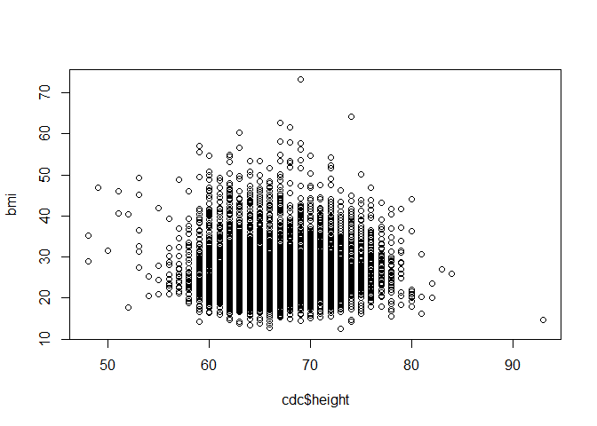
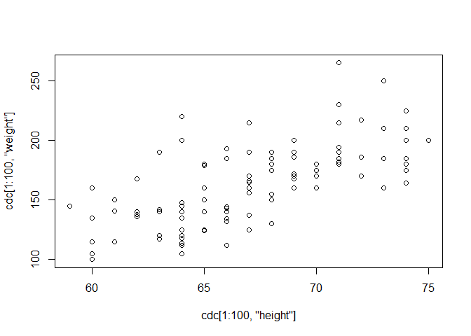

# class04


``` r
source("http://thegrantlab.org/misc/cdc.R")
tail(cdc$weight, 20)
```

     [1] 195 210 171 190 180 120 140 200 230 230 195 210 180 165 224 215 200 216 165
    [20] 170

``` r
cor(cdc$height, cdc$weight)
```

    [1] 0.5553222

``` r
# Create height_m

height_m <- cdc$height * 0.0254

# Create weight_kg

weight_kg <- cdc$weight * .454

bmi <- (weight_kg)/(height_m^2)
plot(cdc$height, bmi)
```



``` r
cor(cdc$height, bmi)
```

    [1] 0.03251694

``` r
sum(bmi >= 30)
```

    [1] 3897

``` r
plot(cdc[1:100, "height"], cdc[1:100, "weight"])
```


