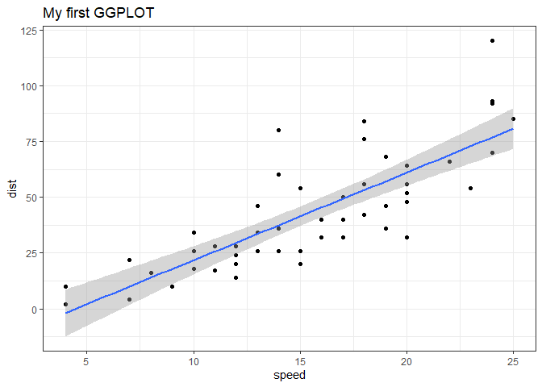
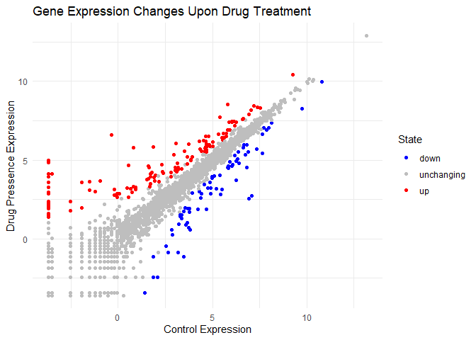
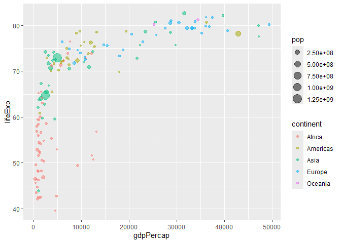

# Class 05: Data Visualization with GGPLOT
Mason Lew (PID: A17533139)

## Intro to ggplot

There are many graphic systems in R (ways to make plots and figures).
these include “base” R plots. Today we will focus mostly on **ggplot2**
package.

Let’s start with a plot of a simple in-built dataset called `cars`.

``` r
head(cars)
```

      speed dist
    1     4    2
    2     4   10
    3     7    4
    4     7   22
    5     8   16
    6     9   10

``` r
plot(cars)
```


Let’s see who we can make this figure using **ggplot**. First I need to
install this package on my computer. To install any R package, I use the
function `install.package()`.

> I will run `install.package("ggplot2")` in my R console not this
> quarto document! (so it does not download everytime I render the
> document).

Before I can use any functions from add on packages, I need to load the
package from my “library()” with the `library(ggplot2)` call.

``` r
library(ggplot2)

ggplot(cars)
```


The above graph does not render because all ggplot figures have at least
3 things (called layers). These include:

- **data** (the input dataset I want to plot from).
- **aes** (the aesthetic mapping of the data to my plot).
- **geoms** (the geom_point(), geom_line() etc. that I want to draw).

``` r
ggplot(cars) + 
  aes(x= speed, y= dist) +
  geom_point()
```


lets add a line to show the relationship here:

``` r
ggplot(cars) + 
  aes(x=speed, y=dist) +
  geom_point() +
  geom_smooth(method="lm") +
  theme_bw() +
  labs(title="My first GGPLOT")
```

    `geom_smooth()` using formula = 'y ~ x'



> Which geometiric layer should be used to create scatter plots in
> ggplot2?

geom_point()

## Gene Expression figure

The code to read the data set

``` r
url <- "https://bioboot.github.io/bimm143_S20/class-material/up_down_expression.txt"
genes <- read.delim(url)
head(genes)
```

            Gene Condition1 Condition2      State
    1      A4GNT -3.6808610 -3.4401355 unchanging
    2       AAAS  4.5479580  4.3864126 unchanging
    3      AASDH  3.7190695  3.4787276 unchanging
    4       AATF  5.0784720  5.0151916 unchanging
    5       AATK  0.4711421  0.5598642 unchanging
    6 AB015752.4 -3.6808610 -3.5921390 unchanging

> How many genes are in this dataset?

``` r
nrow(genes)
```

    [1] 5196

> Use the colnames() function and the ncol() function on the genes data
> frame to find out what the column names are (we will need these later)
> and how many columns there are. How many columns did you find?

``` r
colnames(genes)
```

    [1] "Gene"       "Condition1" "Condition2" "State"     

> Use the table() function on the State column of this data.frame to
> find out how many ‘up’ regulated genes there are. What is your answer?

``` r
table(genes$State)
```


          down unchanging         up 
            72       4997        127 

> Using your values above and 2 significant figures. What fraction of
> total genes is up-regulated in this dataset?

``` r
n.tot <- nrow(genes)
vals <- table(genes$State)

vals.percent <- vals/n.tot * 100
round(vals.percent,2)
```


          down unchanging         up 
          1.39      96.17       2.44 

A first plot of this dataset

``` r
p <- ggplot(genes) +
  aes(x=Condition1, y=Condition2, col=State) +
  geom_point() +
  labs(title = "Gene Expression Changes Upon Drug Treatment", 
       x="Control Expression",
       y="Drug Pressence Expression") +
  theme_minimal() + scale_color_manual(values=c("blue", "gray", "red"))

p
```



## Going Further Using Gapminder

First I will install gapminder and dply using
`install.packages("gapminder")` and `install.packages("dplyr")` again
this is done in the R console so gapminder and dplyr does not install
every time I render this document

``` r
library(gapminder)
library(dplyr)
```


    Attaching package: 'dplyr'

    The following objects are masked from 'package:stats':

        filter, lag

    The following objects are masked from 'package:base':

        intersect, setdiff, setequal, union

``` r
url <- "https://raw.githubusercontent.com/jennybc/gapminder/master/inst/extdata/gapminder.tsv"

gapminder <- read.delim(url)

head(gapminder)
```

          country continent year lifeExp      pop gdpPercap
    1 Afghanistan      Asia 1952  28.801  8425333  779.4453
    2 Afghanistan      Asia 1957  30.332  9240934  820.8530
    3 Afghanistan      Asia 1962  31.997 10267083  853.1007
    4 Afghanistan      Asia 1967  34.020 11537966  836.1971
    5 Afghanistan      Asia 1972  36.088 13079460  739.9811
    6 Afghanistan      Asia 1977  38.438 14880372  786.1134

``` r
gapminder_2007 <- gapminder %>% filter(year==2007)
```

Let’s consider the gapminder_2007 dataset which contains the variables
GDP per capita gdpPercap and life expectancy lifeExp for 142 countries
in the year 2007.

``` r
ggplot(gapminder_2007) +
  aes(x=gdpPercap, y=lifeExp, color=continent, size=pop) +
  geom_point(alpha=0.5)
```



Now, let’s see how the plot looks like if we color the points by the
numeric variable population pop:

``` r
ggplot(gapminder_2007) + 
  aes(x = gdpPercap, y = lifeExp, color = pop) +
  geom_point(alpha=0.8)
```


For the gapminder_2007 dataset we can plot the GDP per capita
(x=gdpPercap) vs. the life expectancy (y=lifeExp) and set the point size
based on the population (size=pop) of each country we can use:

``` r
ggplot(gapminder_2007) + 
  aes(x = gdpPercap, y = lifeExp, size = pop) +
  geom_point(alpha=0.5)
```


However, the size scaling is not to scale. To do this use the
`scale_size_area()` function.

``` r
ggplot(gapminder_2007) + 
  geom_point(aes(x = gdpPercap, y = lifeExp,
                 size = pop), alpha=0.5) + 
  scale_size_area(max_size = 10)
```


> Can you adapt the code you have learned thus far to reproduce our
> gapminder scatter plot for the year 1957? What do you notice about
> this plot is it easy to compare with the one for 2007?

``` r
gapminder_1957 <- gapminder %>% filter(year==1957)

ggplot(gapminder_1957) +
  aes(x=gdpPercap, y=lifeExp, col=continent, size = pop) +
  geom_point(alpha=0.7) +
  scale_size_area(max_size=15)
```


> Do the same steps above but include 1957 and 2007 in your input
> dataset for ggplot(). You should now include the layer
> facet_wrap(~year) to produce the following plot:

``` r
gapminder_1957_2007 <- gapminder %>% filter(year==1957 | year==2007)

ggplot(gapminder_1957_2007) +
  aes(x=gdpPercap, y=lifeExp, col=continent, size = pop) +
  geom_point(alpha=0.7) +
  scale_size_area(max_size=10) +
  facet_wrap(~year)
```


## Intro to Bar Charts

Below you can find an example showing the number of people (in millions)
in the five biggest countries by population in 2007:

``` r
gapminder_top5 <- gapminder %>% 
  filter(year==2007) %>% 
  arrange(desc(pop)) %>% 
  top_n(5, pop)

gapminder_top5
```

            country continent year lifeExp        pop gdpPercap
    1         China      Asia 2007  72.961 1318683096  4959.115
    2         India      Asia 2007  64.698 1110396331  2452.210
    3 United States  Americas 2007  78.242  301139947 42951.653
    4     Indonesia      Asia 2007  70.650  223547000  3540.652
    5        Brazil  Americas 2007  72.390  190010647  9065.801

Creating a simple bar chart uses `geom_col()` function. This requires
the x aesthetic mapping which defines the different bars to be plotted
and the y mapping which defines the variable associated with the height
of each bar.

Let’s create out first bar chart with the `gapminder_top5` dataset

``` r
ggplot(gapminder_top5) + 
  aes(x = country, y = pop) +
  geom_col()
```


`geom_col()` allows users to map additional dataset variables to the
color attribute of the bar. The `fill` aesthetic can be used to fill the
entire bars with color

``` r
ggplot(gapminder_top5) + 
  aes(x = country, y = pop, fill = continent) +
  geom_col()
```


Let’s see what happens if we use a **numeric** variable like life
expectancy lifeExp instead:

``` r
ggplot(gapminder_top5) +
  aes(x=reorder(country, -pop), y=pop, fill=gdpPercap) +
  geom_col()
```


In some circumstances it might be useful to rotate (or “flip”) your
plots to enable a more clear visualization. For this we can use the
`coord_flip()` function. Lets look at an example considering arrest data
in US states. This is another in-bult dataset called `USArrests`.

``` r
head(USArrests)
```

               Murder Assault UrbanPop Rape
    Alabama      13.2     236       58 21.2
    Alaska       10.0     263       48 44.5
    Arizona       8.1     294       80 31.0
    Arkansas      8.8     190       50 19.5
    California    9.0     276       91 40.6
    Colorado      7.9     204       78 38.7

``` r
USArrests$State <- rownames(USArrests)
ggplot(USArrests) +
  aes(x=reorder(State,Murder), y=Murder) +
  geom_col() +
  coord_flip()
```


The produced flipped bar graph appears to be crowed. Let’s try an
alternative custom visualization by combining `geom_point()` and
`geom_segment()`:

``` r
ggplot(USArrests) +
  aes(x=reorder(State,Murder), y=Murder) +
  geom_point() +
  geom_segment(aes(x=State, 
                   xend=State, 
                   y=0, 
                   yend=Murder), color="blue") +
  coord_flip()
```


\##Extensions: Animation

I will now install **gganimate** and **gifski**. For reasons explained
before, I will type `install.packages("gifski")` and
`install.packages("gganimate")`

``` r
library(gapminder)
library(gganimate)

# Setup nice regular ggplot of the gapminder data
ggplot(gapminder, aes(gdpPercap, lifeExp, size = pop, colour = country)) +
  geom_point(alpha = 0.7, show.legend = FALSE) +
  scale_colour_manual(values = country_colors) +
  scale_size(range = c(2, 12)) +
  scale_x_log10() +
  # Facet by continent
  facet_wrap(~continent) +
  # Here comes the gganimate specific bits
  labs(title = 'Year: {frame_time}', x = 'GDP per capita', y = 'life expectancy') +
  transition_time(year) +
  shadow_wake(wake_length = 0.1, alpha = FALSE)
```


\##Combining Plots Using Patchwork

I will now install patchwork using `install.packages('patchwork')`

Another excellent package extending ggplot is patchwork that is useful
for combining plots to make an all-in-one multi-panel figure. For
example:

``` r
library(patchwork)

# Setup some example plots 
p1 <- ggplot(mtcars) + geom_point(aes(mpg, disp))
p2 <- ggplot(mtcars) + geom_boxplot(aes(gear, disp, group = gear))
p3 <- ggplot(mtcars) + geom_smooth(aes(disp, qsec))
p4 <- ggplot(mtcars) + geom_bar(aes(carb))

# Use patchwork to combine them here:
(p1 | p2 | p3) /
      p4
```

    `geom_smooth()` using method = 'loess' and formula = 'y ~ x'


