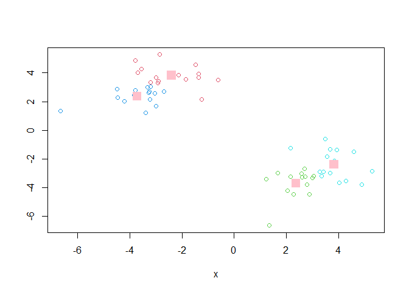

# class07
Mason Lew (PID: A17533139)

Today we will explore unsupervised machine learning methods including
clustering and dimensional reduction methods.

Let’s start by making up some data (where we know there are clear
groups/clusters) that we can use to test out different clustering
methods

we can use the `rnorm()` function to help us here:

``` r
hist(rnorm(3000, 3))
```


Make data with two “clusters”

``` r
x <- c(rnorm(30, -3),
      rnorm(30, 3))

z <- cbind(x, rev(x))
head(z)
```

                 x         
    [1,] -3.206558 3.048144
    [2,] -3.793048 4.888591
    [3,] -2.856037 5.276183
    [4,] -3.254614 2.721283
    [5,] -2.688891 2.694264
    [6,] -1.848144 3.557098

``` r
plot(z)
```


How big is `z`?

``` r
nrow(z)
```

    [1] 60

``` r
ncol(z)
```

    [1] 2

## K-means clustering

The main function in “base” R for K-means clustering is called
`kmeans()`

``` r
k <- kmeans(z, 2)
k
```

    K-means clustering with 2 clusters of sizes 30, 30

    Cluster means:
              x          
    1 -3.062307  3.094463
    2  3.094463 -3.062307

    Clustering vector:
     [1] 1 1 1 1 1 1 1 1 1 1 1 1 1 1 1 1 1 1 1 1 1 1 1 1 1 1 1 1 1 1 2 2 2 2 2 2 2 2
    [39] 2 2 2 2 2 2 2 2 2 2 2 2 2 2 2 2 2 2 2 2 2 2

    Within cluster sum of squares by cluster:
    [1] 69.5862 69.5862
     (between_SS / total_SS =  89.1 %)

    Available components:

    [1] "cluster"      "centers"      "totss"        "withinss"     "tot.withinss"
    [6] "betweenss"    "size"         "iter"         "ifault"      

``` r
attributes(k)
```

    $names
    [1] "cluster"      "centers"      "totss"        "withinss"     "tot.withinss"
    [6] "betweenss"    "size"         "iter"         "ifault"      

    $class
    [1] "kmeans"

> Q. How many points lie in each cluster?

``` r
k$size
```

    [1] 30 30

> Q. What component of our results tells us about the cluster membership
> (i.e. which point lie in which cluster)?

``` r
k$cluster
```

     [1] 1 1 1 1 1 1 1 1 1 1 1 1 1 1 1 1 1 1 1 1 1 1 1 1 1 1 1 1 1 1 2 2 2 2 2 2 2 2
    [39] 2 2 2 2 2 2 2 2 2 2 2 2 2 2 2 2 2 2 2 2 2 2

> Q. Center of each cluster?

``` r
k$centers
```

              x          
    1 -3.062307  3.094463
    2  3.094463 -3.062307

> Q. Put this reult info together and make a little “base R” plot of our
> clustering reult. Also add the cluster center points to this plot.

You can color by number.

``` r
plot(z, col=c(1,2))
```


``` r
plot(z, col = k$cluster + 1)
points(k$centers, col = "blue", pch = 15, cex = 2)
```


> Q. Run Kmeans on our input `z` and define 4 clusters making the same
> result visualization as above (plot of z collored by cluster
> membership)

``` r
p <- kmeans(z, 4)

plot(z, col = p$cluster + 1)
points(p$centers, col = "pink", pch = 15, cex = 2)
```



How to tell if the k is good:

``` r
p$tot.withinss
```

    [1] 80.55246

``` r
k$tot.withinss
```

    [1] 139.1724

## Hierarchical Clustering

The main function in base R for this called `hclust()` it will take as
input a distance matrix (key point is that you can’t just give your
“raw” data as input - you have to first calculate a distance matrix from
your data).

``` r
d <- dist(z)
hc <- hclust(d)
hc
```


    Call:
    hclust(d = d)

    Cluster method   : complete 
    Distance         : euclidean 
    Number of objects: 60 

``` r
plot(hc)
abline(h=10, col = "red")
```


Once I inspect the “tree” I can “cut” the tree to yield my groupings or
clusters. The function to do this is called `cutree()`

``` r
grps <- cutree(hc, h = 10)
grps
```

     [1] 1 1 1 1 1 1 1 1 1 1 1 1 1 1 1 1 1 1 1 1 1 1 1 1 1 1 1 1 1 1 2 2 2 2 2 2 2 2
    [39] 2 2 2 2 2 2 2 2 2 2 2 2 2 2 2 2 2 2 2 2 2 2

``` r
plot(z, col=grps)
```


## Hands on with Principal Component Analysis (PCA)

Lets do a 17 dimensional data analysis of EU eating habits

### Data import

``` r
url <- "https://tinyurl.com/UK-foods"
x <- read.csv(url, row.names = 1)
head(t(x))
```

              Cheese Carcass_meat  Other_meat  Fish Fats_and_oils  Sugars
    England      105           245         685  147            193    156
    Wales        103           227         803  160            235    175
    Scotland     103           242         750  122            184    147
    N.Ireland     66           267         586   93            209    139
              Fresh_potatoes  Fresh_Veg  Other_Veg  Processed_potatoes 
    England               720        253        488                 198
    Wales                 874        265        570                 203
    Scotland              566        171        418                 220
    N.Ireland            1033        143        355                 187
              Processed_Veg  Fresh_fruit  Cereals  Beverages Soft_drinks 
    England              360         1102     1472        57         1374
    Wales                365         1137     1582        73         1256
    Scotland             337          957     1462        53         1572
    N.Ireland            334          674     1494        47         1506
              Alcoholic_drinks  Confectionery 
    England                 375             54
    Wales                   475             64
    Scotland                458             62
    N.Ireland               135             41

> Q1. How many rows and columns are in your new data frame named x? What
> R functions could you use to answer this questions?

``` r
nrow(x)
```

    [1] 17

``` r
ncol(x)
```

    [1] 4

``` r
dim(x)
```

    [1] 17  4

> Q2. Which approach to solving the ‘row-names problem’ mentioned above
> do you prefer and why? Is one approach more robust than another under
> certain circumstances?

The `row.names=1` argument setting is my preferred method of solving
this issue. I would say this method is much more robust that using
`x[-1]` every time I need to skip the first row.

``` r
barplot(as.matrix(x), beside=T, col=rainbow(nrow(x)))
```


> Q3: Changing what optional argument in the above barplot() function
> results in the following plot?

The `beside = F` argument stacks the bars within each country ontop of
each other.

``` r
barplot(as.matrix(x), beside=F, col=rainbow(nrow(x)))
```


> Q5: Generating all pairwise plots may help somewhat. Can you make
> sense of the following code and resulting figure? What does it mean if
> a given point lies on the diagonal for a given plot?

``` r
pairs(x, col=rainbow(nrow(x)), pch=16)
```


> Q6. What is the main differences between N. Ireland and the other
> countries of the UK in terms of this data-set?

North Ireland seems to consume less fish and more

Looking at these types of “pairwise plots” can be helpful but does not
scale well and sucks!There must be a better way…

### PCA to the Rescue!

The main function for PCA in base R is called `prcomp()`. This function
wants the transpose of our input data - i.e. the important food
categories in columns and the countries as rows.

``` r
pca <- prcomp(t(x))
summary(pca)
```

    Importance of components:
                                PC1      PC2      PC3       PC4
    Standard deviation     324.1502 212.7478 73.87622 3.176e-14
    Proportion of Variance   0.6744   0.2905  0.03503 0.000e+00
    Cumulative Proportion    0.6744   0.9650  1.00000 1.000e+00

Lets see what is in our PCA result object `pca`

``` r
attributes(pca)
```

    $names
    [1] "sdev"     "rotation" "center"   "scale"    "x"       

    $class
    [1] "prcomp"

The `pca$x` result object is where we will focus first as this details
how the countries are related to each other in terms of our new “axis”
(a.k.a. “PCs”, “eigenvectors”, etc.)

``` r
head(pca$x)
```

                     PC1         PC2        PC3           PC4
    England   -144.99315   -2.532999 105.768945 -4.894696e-14
    Wales     -240.52915 -224.646925 -56.475555  5.700024e-13
    Scotland   -91.86934  286.081786 -44.415495 -7.460785e-13
    N.Ireland  477.39164  -58.901862  -4.877895  2.321303e-13

> Q7. Complete the code below to generate a plot of PC1 vs PC2. The
> second line adds text labels over the data points.

``` r
plot(pca$x[,1], pca$x[,2], pch = 1, cex = 2, 
     xlab = "PC1", ylab = "PC2", text(pca$x[,1], pca$x[,2], rownames(pca$x), col = "green"),
     dev.new(height = 500, units = 'cm')) 
```

> Q8. Customize your plot so that the colors of the country names match
> the colors in our UK and Ireland map and table at start of this
> document.

``` r
plot(pca$x[,1], pca$x[,2], pch = 16, cex = 2, col = c("orange", "red", "blue", "darkgreen"),
     xlab = "PC1", ylab = "PC2")
```


We can look at the so-called PC “loadings” result object to see how the
original foods contribute to our new PCs (i.e. how the original
variables contribute to our new better variables).

``` r
par(mar=c(10, 3, 0.35, 0))
barplot( pca$rotation[,1], las=2 )
```


> Q9: Generate a similar ‘loadings plot’ for PC2. What two food groups
> feature prominantely and what does PC2 maninly tell us about?

``` r
par(mar=c(10, 3, 0.35, 0))
barplot( pca$rotation[,2], las=2 )
```


The two food groups that are the most prominently featured are,
Fresh_potatoes, and Alcoholic drinks. PC2 is the second principal
component which is a measure of directional variance in a perpendicular
direction to PC1.

### PCA of RNA-seq Data

``` r
url2 <- "https://tinyurl.com/expression-CSV"
rna.data <- read.csv(url2, row.names=1)
head(rna.data)
```

           wt1 wt2  wt3  wt4 wt5 ko1 ko2 ko3 ko4 ko5
    gene1  439 458  408  429 420  90  88  86  90  93
    gene2  219 200  204  210 187 427 423 434 433 426
    gene3 1006 989 1030 1017 973 252 237 238 226 210
    gene4  783 792  829  856 760 849 856 835 885 894
    gene5  181 249  204  244 225 277 305 272 270 279
    gene6  460 502  491  491 493 612 594 577 618 638

> Q10: How many genes and samples are in this data set?

``` r
nrow(rna.data)
```

    [1] 100

``` r
## Again we have to take the transpose of our data 
pca <- prcomp(t(rna.data), scale=TRUE)
 
## Simple un polished plot of pc1 and pc2
plot(pca$x[,1], pca$x[,2], xlab="PC1", ylab="PC2")
```


``` r
## Variance captured per PC 
pca.var <- pca$sdev^2

## Percent variance is often more informative to look at 
pca.var.per <- round(pca.var/sum(pca.var)*100, 1)
pca.var.per
```

     [1] 92.6  2.3  1.1  1.1  0.8  0.7  0.6  0.4  0.4  0.0

``` r
colvec <- colnames(rna.data)
colvec[grep("wt", colvec)] <- "red"
colvec[grep("ko", colvec)] <- "blue"

plot(pca$x[,1], pca$x[,2], col=colvec, pch=16,
     xlab=paste0("PC1 (", pca.var.per[1], "%)"),
     ylab=paste0("PC2 (", pca.var.per[2], "%)"))

text(pca$x[,1], pca$x[,2], labels = colnames(rna.data), pos=c(rep(4,5), rep(2,5)))
```


