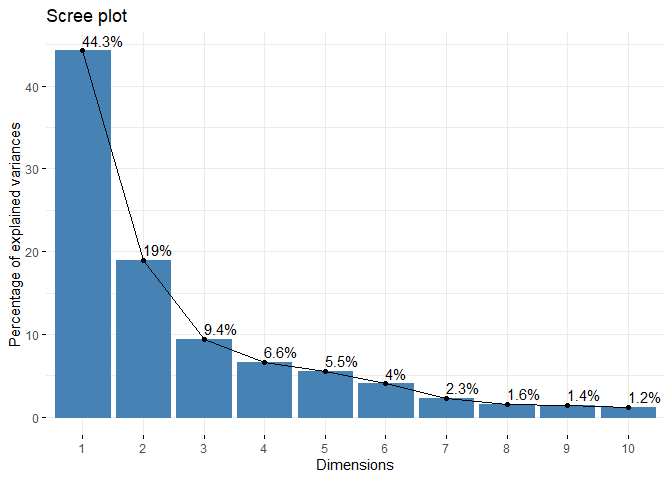

# class8: PCR Mini Project
Mason Lew (PID: A17533139)

Today we will do a complete analysis of some breast cancer biopsy data
but first, let’s revisit the main PCA function in `R precomp()` and see
what `scale=TRUE/False` does

``` r
head(mtcars)
```

                       mpg cyl disp  hp drat    wt  qsec vs am gear carb
    Mazda RX4         21.0   6  160 110 3.90 2.620 16.46  0  1    4    4
    Mazda RX4 Wag     21.0   6  160 110 3.90 2.875 17.02  0  1    4    4
    Datsun 710        22.8   4  108  93 3.85 2.320 18.61  1  1    4    1
    Hornet 4 Drive    21.4   6  258 110 3.08 3.215 19.44  1  0    3    1
    Hornet Sportabout 18.7   8  360 175 3.15 3.440 17.02  0  0    3    2
    Valiant           18.1   6  225 105 2.76 3.460 20.22  1  0    3    1

The mean values per coloumn of the mtcars data:

``` r
apply(mtcars, 2, mean)
```

           mpg        cyl       disp         hp       drat         wt       qsec 
     20.090625   6.187500 230.721875 146.687500   3.596563   3.217250  17.848750 
            vs         am       gear       carb 
      0.437500   0.406250   3.687500   2.812500 

The Sd values per coloumn of the mtcars data:

``` r
apply(mtcars, 2, sd)
```

            mpg         cyl        disp          hp        drat          wt 
      6.0269481   1.7859216 123.9386938  68.5628685   0.5346787   0.9784574 
           qsec          vs          am        gear        carb 
      1.7869432   0.5040161   0.4989909   0.7378041   1.6152000 

Disp and Hp have the hightest mean value and the highest standard
deviation meaning that they will most likely dominate analysis 1 of this
data. Let’s see:

``` r
pc.noscale <- prcomp(mtcars, scale = FALSE)
pc.scale <- prcomp(mtcars, scale = TRUE)
```

``` r
biplot(pc.noscale)
```


``` r
pc.noscale$rotation[,1]
```

             mpg          cyl         disp           hp         drat           wt 
    -0.038118199  0.012035150  0.899568146  0.434784387 -0.002660077  0.006239405 
            qsec           vs           am         gear         carb 
    -0.006671270 -0.002729474 -0.001962644 -0.002604768  0.005766010 

Plot the loadings

``` r
library(ggplot2)

r1 <- as.data.frame(pc.noscale$rotation)
r1$names <- rownames(pc.noscale$rotation)

ggplot(r1) + aes(PC1, names) + geom_col()
```


``` r
r2 <- as.data.frame(pc.scale$rotation)
r2$names <- rownames(pc.scale$rotation)

ggplot(r2) +
  aes(PC1, names) +
  geom_col()
```


``` r
biplot(pc.scale)
```


***Take home:*** generally, we always want to set `scale = TRUE` when we
do this type of analysis to avoid out data being dominated by a
variables with large variance sinmply due to their unit of measurement.

\###FNA Breast Cancer Data

loading the data into R

``` r
# Save your input data file into your Project directory
fna.data <- read.csv("WisconsinCancer.csv")

# Complete the following code to input the data and store as wisc.df
wisc.df <- data.frame(fna.data, row.names=1)
head(wisc.df)
```

             diagnosis radius_mean texture_mean perimeter_mean area_mean
    842302           M       17.99        10.38         122.80    1001.0
    842517           M       20.57        17.77         132.90    1326.0
    84300903         M       19.69        21.25         130.00    1203.0
    84348301         M       11.42        20.38          77.58     386.1
    84358402         M       20.29        14.34         135.10    1297.0
    843786           M       12.45        15.70          82.57     477.1
             smoothness_mean compactness_mean concavity_mean concave.points_mean
    842302           0.11840          0.27760         0.3001             0.14710
    842517           0.08474          0.07864         0.0869             0.07017
    84300903         0.10960          0.15990         0.1974             0.12790
    84348301         0.14250          0.28390         0.2414             0.10520
    84358402         0.10030          0.13280         0.1980             0.10430
    843786           0.12780          0.17000         0.1578             0.08089
             symmetry_mean fractal_dimension_mean radius_se texture_se perimeter_se
    842302          0.2419                0.07871    1.0950     0.9053        8.589
    842517          0.1812                0.05667    0.5435     0.7339        3.398
    84300903        0.2069                0.05999    0.7456     0.7869        4.585
    84348301        0.2597                0.09744    0.4956     1.1560        3.445
    84358402        0.1809                0.05883    0.7572     0.7813        5.438
    843786          0.2087                0.07613    0.3345     0.8902        2.217
             area_se smoothness_se compactness_se concavity_se concave.points_se
    842302    153.40      0.006399        0.04904      0.05373           0.01587
    842517     74.08      0.005225        0.01308      0.01860           0.01340
    84300903   94.03      0.006150        0.04006      0.03832           0.02058
    84348301   27.23      0.009110        0.07458      0.05661           0.01867
    84358402   94.44      0.011490        0.02461      0.05688           0.01885
    843786     27.19      0.007510        0.03345      0.03672           0.01137
             symmetry_se fractal_dimension_se radius_worst texture_worst
    842302       0.03003             0.006193        25.38         17.33
    842517       0.01389             0.003532        24.99         23.41
    84300903     0.02250             0.004571        23.57         25.53
    84348301     0.05963             0.009208        14.91         26.50
    84358402     0.01756             0.005115        22.54         16.67
    843786       0.02165             0.005082        15.47         23.75
             perimeter_worst area_worst smoothness_worst compactness_worst
    842302            184.60     2019.0           0.1622            0.6656
    842517            158.80     1956.0           0.1238            0.1866
    84300903          152.50     1709.0           0.1444            0.4245
    84348301           98.87      567.7           0.2098            0.8663
    84358402          152.20     1575.0           0.1374            0.2050
    843786            103.40      741.6           0.1791            0.5249
             concavity_worst concave.points_worst symmetry_worst
    842302            0.7119               0.2654         0.4601
    842517            0.2416               0.1860         0.2750
    84300903          0.4504               0.2430         0.3613
    84348301          0.6869               0.2575         0.6638
    84358402          0.4000               0.1625         0.2364
    843786            0.5355               0.1741         0.3985
             fractal_dimension_worst
    842302                   0.11890
    842517                   0.08902
    84300903                 0.08758
    84348301                 0.17300
    84358402                 0.07678
    843786                   0.12440

We can use `[-1]` to remove the first column of labels:

``` r
wisc.data <- wisc.df[,-1]
```

Setup a separate new vector called `diagnosis` that contains the data
from the diagnosis column of the original dataset. We will store this as
a `factor` (useful for plotting) and use this later to check our
results.

``` r
diagnosis <- as.factor(wisc.df$diagnosis)

head(diagnosis)
```

    [1] M M M M M M
    Levels: B M

> Q1. How many observations are in this dataset?

``` r
nrow(wisc.df)
```

    [1] 569

> Q2. How many of the observations have a malignant diagnosis?

``` r
sum(wisc.df$diagnosis == "M")
```

    [1] 212

alternatively, one could also you the \`table function:

``` r
table(wisc.df$diagnosis)
```


      B   M 
    357 212 

> Q3. How many variables/features in the data are suffixed with \_mean?

``` r
colnames(wisc.df)
```

     [1] "diagnosis"               "radius_mean"            
     [3] "texture_mean"            "perimeter_mean"         
     [5] "area_mean"               "smoothness_mean"        
     [7] "compactness_mean"        "concavity_mean"         
     [9] "concave.points_mean"     "symmetry_mean"          
    [11] "fractal_dimension_mean"  "radius_se"              
    [13] "texture_se"              "perimeter_se"           
    [15] "area_se"                 "smoothness_se"          
    [17] "compactness_se"          "concavity_se"           
    [19] "concave.points_se"       "symmetry_se"            
    [21] "fractal_dimension_se"    "radius_worst"           
    [23] "texture_worst"           "perimeter_worst"        
    [25] "area_worst"              "smoothness_worst"       
    [27] "compactness_worst"       "concavity_worst"        
    [29] "concave.points_worst"    "symmetry_worst"         
    [31] "fractal_dimension_worst"

A useful function here is `grep()`

``` r
length( #how many _mean's were found
  grep("_mean", colnames(wisc.df))) #which columns "_mean" were found in
```

    [1] 10

Let’s see if we can cluster `wisc.data` to find some structure in the
dataset

``` r
hc <- hclust(dist(wisc.data))

plot(hc)
```


### Principal Componenet Analysis

\##Performing PCA

Execute PCA with the `prcomp()` function on the `wisc.data`, scaling if
appropriate, and assign the output model to `wisc.pr`. Finally let’s
inspect a summary of the results with the `summary()` function

``` r
wisc.pr <- prcomp(wisc.data, scale = TRUE)
summary(wisc.pr)
```

    Importance of components:
                              PC1    PC2     PC3     PC4     PC5     PC6     PC7
    Standard deviation     3.6444 2.3857 1.67867 1.40735 1.28403 1.09880 0.82172
    Proportion of Variance 0.4427 0.1897 0.09393 0.06602 0.05496 0.04025 0.02251
    Cumulative Proportion  0.4427 0.6324 0.72636 0.79239 0.84734 0.88759 0.91010
                               PC8    PC9    PC10   PC11    PC12    PC13    PC14
    Standard deviation     0.69037 0.6457 0.59219 0.5421 0.51104 0.49128 0.39624
    Proportion of Variance 0.01589 0.0139 0.01169 0.0098 0.00871 0.00805 0.00523
    Cumulative Proportion  0.92598 0.9399 0.95157 0.9614 0.97007 0.97812 0.98335
                              PC15    PC16    PC17    PC18    PC19    PC20   PC21
    Standard deviation     0.30681 0.28260 0.24372 0.22939 0.22244 0.17652 0.1731
    Proportion of Variance 0.00314 0.00266 0.00198 0.00175 0.00165 0.00104 0.0010
    Cumulative Proportion  0.98649 0.98915 0.99113 0.99288 0.99453 0.99557 0.9966
                              PC22    PC23   PC24    PC25    PC26    PC27    PC28
    Standard deviation     0.16565 0.15602 0.1344 0.12442 0.09043 0.08307 0.03987
    Proportion of Variance 0.00091 0.00081 0.0006 0.00052 0.00027 0.00023 0.00005
    Cumulative Proportion  0.99749 0.99830 0.9989 0.99942 0.99969 0.99992 0.99997
                              PC29    PC30
    Standard deviation     0.02736 0.01153
    Proportion of Variance 0.00002 0.00000
    Cumulative Proportion  1.00000 1.00000

> Q4. From your results, what proportion of the original variance is
> captured by the first principal components (PC1)?

.4427

> Q5. How many principal components (PCs) are required to describe at
> least 70% of the original variance in the data?

Need up to at least PC3

> Q6. How many principal components (PCs) are required to describe at
> least 90% of the original variance in the data?

need up to at least PC7

\##Interpreting PCA results

``` r
biplot(wisc.pr)
```


> Q7. What stands out to you about this plot? Is it easy or difficult to
> understand? Why?

I can’t see anything… this plot seems useless at first glance. Building
a PCA score plot of PC1 and PC2 might yield better results

``` r
attributes(wisc.pr)
```

    $names
    [1] "sdev"     "rotation" "center"   "scale"    "x"       

    $class
    [1] "prcomp"

``` r
head(wisc.pr$x)
```

                   PC1        PC2        PC3       PC4        PC5         PC6
    842302   -9.184755  -1.946870 -1.1221788 3.6305364  1.1940595  1.41018364
    842517   -2.385703   3.764859 -0.5288274 1.1172808 -0.6212284  0.02863116
    84300903 -5.728855   1.074229 -0.5512625 0.9112808  0.1769302  0.54097615
    84348301 -7.116691 -10.266556 -3.2299475 0.1524129  2.9582754  3.05073750
    84358402 -3.931842   1.946359  1.3885450 2.9380542 -0.5462667 -1.22541641
    843786   -2.378155  -3.946456 -2.9322967 0.9402096  1.0551135 -0.45064213
                     PC7         PC8         PC9       PC10       PC11       PC12
    842302    2.15747152  0.39805698 -0.15698023 -0.8766305 -0.2627243 -0.8582593
    842517    0.01334635 -0.24077660 -0.71127897  1.1060218 -0.8124048  0.1577838
    84300903 -0.66757908 -0.09728813  0.02404449  0.4538760  0.6050715  0.1242777
    84348301  1.42865363 -1.05863376 -1.40420412 -1.1159933  1.1505012  1.0104267
    84358402 -0.93538950 -0.63581661 -0.26357355  0.3773724 -0.6507870 -0.1104183
    843786    0.49001396  0.16529843 -0.13335576 -0.5299649 -0.1096698  0.0813699
                    PC13         PC14         PC15        PC16        PC17
    842302    0.10329677 -0.690196797  0.601264078  0.74446075 -0.26523740
    842517   -0.94269981 -0.652900844 -0.008966977 -0.64823831 -0.01719707
    84300903 -0.41026561  0.016665095 -0.482994760  0.32482472  0.19075064
    84348301 -0.93245070 -0.486988399  0.168699395  0.05132509  0.48220960
    84358402  0.38760691 -0.538706543 -0.310046684 -0.15247165  0.13302526
    843786   -0.02625135  0.003133944 -0.178447576 -0.01270566  0.19671335
                    PC18       PC19        PC20         PC21        PC22
    842302   -0.54907956  0.1336499  0.34526111  0.096430045 -0.06878939
    842517    0.31801756 -0.2473470 -0.11403274 -0.077259494  0.09449530
    84300903 -0.08789759 -0.3922812 -0.20435242  0.310793246  0.06025601
    84348301 -0.03584323 -0.0267241 -0.46432511  0.433811661  0.20308706
    84358402 -0.01869779  0.4610302  0.06543782 -0.116442469  0.01763433
    843786   -0.29727706 -0.1297265 -0.07117453 -0.002400178  0.10108043
                    PC23         PC24         PC25         PC26        PC27
    842302    0.08444429  0.175102213  0.150887294 -0.201326305 -0.25236294
    842517   -0.21752666 -0.011280193  0.170360355 -0.041092627  0.18111081
    84300903 -0.07422581 -0.102671419 -0.171007656  0.004731249  0.04952586
    84348301 -0.12399554 -0.153294780 -0.077427574 -0.274982822  0.18330078
    84358402  0.13933105  0.005327110 -0.003059371  0.039219780  0.03213957
    843786    0.03344819 -0.002837749 -0.122282765 -0.030272333 -0.08438081
                      PC28         PC29          PC30
    842302   -0.0338846387  0.045607590  0.0471277407
    842517    0.0325955021 -0.005682424  0.0018662342
    84300903  0.0469844833  0.003143131 -0.0007498749
    84348301  0.0424469831 -0.069233868  0.0199198881
    84358402 -0.0347556386  0.005033481 -0.0211951203
    843786    0.0007296587 -0.019703996 -0.0034564331

Plot of PC1 vs. PC2 the first columns

``` r
plot(wisc.pr$x[,2], col = diagnosis,
     xlab = "PC1", ylab = "PC2")
```


Make a ggplot version of this score plot

``` r
pc <- as.data.frame(wisc.pr$x)

ggplot(pc) + aes(PC1, PC2, col = diagnosis) +
  geom_point()
```


PCA compresses data into something that still captures the
essence(trends/interpretations) of the original data. I.e. it takes a
dataset with a lot of dimensions and flattens it into 2 or 3 dimensions
so we can loot at it.

> Q8. Generate a similar plot for principal components 1 and 3. What do
> you notice about these plots?

``` r
plot(wisc.pr$x[,4], col = diagnosis, 
     xlab = "PC1", ylab = "PC3")
```


## variance Explained

``` r
# Calculate variance of each component
pr.var <- wisc.pr$sdev^2
head(pr.var)
```

    [1] 13.281608  5.691355  2.817949  1.980640  1.648731  1.207357

``` r
pr.var/sum(pr.var)
```

     [1] 4.427203e-01 1.897118e-01 9.393163e-02 6.602135e-02 5.495768e-02
     [6] 4.024522e-02 2.250734e-02 1.588724e-02 1.389649e-02 1.168978e-02
    [11] 9.797190e-03 8.705379e-03 8.045250e-03 5.233657e-03 3.137832e-03
    [16] 2.662093e-03 1.979968e-03 1.753959e-03 1.649253e-03 1.038647e-03
    [21] 9.990965e-04 9.146468e-04 8.113613e-04 6.018336e-04 5.160424e-04
    [26] 2.725880e-04 2.300155e-04 5.297793e-05 2.496010e-05 4.434827e-06

``` r
# Variance explained by each principal component: pve
pve <- pr.var / sum(pr.var)

# Plot variance explained for each principal component
plot(pve, xlab = "Principal Component", 
     ylab = "Proportion of Variance Explained", 
     ylim = c(0, 1), type = "o")
```


``` r
# Alternative scree plot of the same data, note data driven y-axis
barplot(pve, ylab = "Precent of Variance Explained",
     names.arg=paste0("PC",1:length(pve)), las=2, axes = FALSE)
axis(2, at=pve, labels=round(pve,2)*100 )
```


``` r
## ggplot based graph
#install.packages("factoextra")
library(factoextra)
```

    Welcome! Want to learn more? See two factoextra-related books at https://goo.gl/ve3WBa

``` r
fviz_eig(wisc.pr, addlabels = TRUE)
```



> Q9. For the first principal component, what is the component of the
> loading vector (i.e. wisc.pr\$rotation\[,1\]) for the feature
> concave.points_mean?

``` r
wisc.pr$rotation["concave.points_mean",1]
```

    [1] -0.2608538

> Q10. What is the minimum number of principal components required to
> explain 80% of the variance of the data?

PC5

\##Hierarchical clustering

First scale the `wisc.data` data and assign the result to `data.scaled.`

``` r
# Scale the wisc.data data using the "scale()" function

data.scaled <- scale(wisc.data)
```

Calculate the (Euclidean) distances between all pairs of observations in
the new scaled dataset and assign the result to data.dist.

``` r
data.dist <- dist(data.scaled)
```

Create a hierarchical clustering model using complete linkage. Manually
specify the method argument to `hclust()` and assign the results to
`wisc.hclust`.

``` r
wisc.hclust <- hclust(data.dist, "complete")
```

\##Results of hierarchical clustering

Let’s use the hierarchical clustering model you just created to
determine a height (or distance between clusters) where a certain number
of clusters exists.

> Q11. Using the plot() and abline() functions, what is the height at
> which the clustering model has 4 clusters?

``` r
plot(wisc.hclust)
abline(h=19, col="red", lty=2)
```


\##Selecting number of clusters

``` r
wisc.hclust.clusters <- cutree(wisc.hclust, k=4)
plot(wisc.hclust.clusters)
```


``` r
table(wisc.hclust.clusters, diagnosis)
```

                        diagnosis
    wisc.hclust.clusters   B   M
                       1  12 165
                       2   2   5
                       3 343  40
                       4   0   2

> Q12. Can you find a better cluster vs diagnoses match by cutting into
> a different number of clusters between 2 and 10?

``` r
wisc.hclust.clusters_2 <- cutree(wisc.hclust, k=2)
table(wisc.hclust.clusters_2)
```

    wisc.hclust.clusters_2
      1   2 
    567   2 

``` r
wisc.hclust.clusters_3 <- cutree(wisc.hclust, k=3)
table(wisc.hclust.clusters_3)
```

    wisc.hclust.clusters_3
      1   2   3 
    560   7   2 

``` r
wisc.hclust.clusters_5 <- cutree(wisc.hclust, k=5)
table(wisc.hclust.clusters_5)
```

    wisc.hclust.clusters_5
      1   2   3   4   5 
    177   5 383   2   2 

``` r
wisc.hclust.clusters_6 <- cutree(wisc.hclust, k=6)
table(wisc.hclust.clusters_6)
```

    wisc.hclust.clusters_6
      1   2   3   4   5   6 
    177   5 370   2  13   2 

``` r
wisc.hclust.clusters_7 <- cutree(wisc.hclust, k=7)
table(wisc.hclust.clusters_7)
```

    wisc.hclust.clusters_7
      1   2   3   4   5   6   7 
    177   3 370   2  13   2   2 

``` r
wisc.hclust.clusters_8 <- cutree(wisc.hclust, k=8)
table(wisc.hclust.clusters_8)
```

    wisc.hclust.clusters_8
      1   2   3   4   5   6   7   8 
     98  79   3 370   2  13   2   2 

``` r
wisc.hclust.clusters_9 <- cutree(wisc.hclust, k=9)
table(wisc.hclust.clusters_9)
```

    wisc.hclust.clusters_9
      1   2   3   4   5   6   7   8   9 
     98  79   3 370   2  12   2   2   1 

``` r
wisc.hclust.clusters_10 <- cutree(wisc.hclust, k=10)
table(wisc.hclust.clusters_10)
```

    wisc.hclust.clusters_10
      1   2   3   4   5   6   7   8   9  10 
     98  59   3 370  20   2  12   2   2   1 

All of them kinda sucked. None of them had any distinct benign/malignant
groupings

> Q13. Which method gives your favorite results for the same data.dist
> dataset? Explain your reasoning.

``` r
wisc.hclust_ward.d2 <- hclust(data.dist, "ward.D2")
plot(wisc.hclust_ward.d2)
```


``` r
wisc.hclust.clusters_d2 <- cutree(wisc.hclust_ward.d2, k=3)
table(wisc.hclust.clusters_d2, diagnosis)
```

                           diagnosis
    wisc.hclust.clusters_d2   B   M
                          1   0 115
                          2  20  49
                          3 337  48

``` r
wisc.hclust_single <- hclust(data.dist, "single")

plot(wisc.hclust_single)
```


the `ward.d2` method is nice because it splits the data better into the
two groups: benign and

## K-means clustering

``` r
wisc.km <- kmeans(wisc.data, centers = 2, nstart= 20)
table(wisc.km$cluster, diagnosis)
```

       diagnosis
          B   M
      1   1 130
      2 356  82

> Q14. How well does k-means separate the two diagnoses? How does it
> compare to your hclust results?

``` r
table(wisc.hclust.clusters, diagnosis)
```

                        diagnosis
    wisc.hclust.clusters   B   M
                       1  12 165
                       2   2   5
                       3 343  40
                       4   0   2

K-means separates the data from the two diagnoses fairly well but still
does not fully distinguish the distinct groups. Compared to hclust,
hclust seems to have done a slightly better job separating the data.

\###Combining methods

``` r
hc <- hclust(dist(wisc.pr$x[, 1:2]), method = "ward.D2")

plot(hc)
abline(h=70, col = "red")
```


This looks much more promising than our previous clustering results on
the original scaled data. Note the two main branches of or dendrogram
indicating two main clusters - maybe these are malignant and benign.
Let’s find out!

``` r
grps <- cutree(hc, h=70)
table(grps)
```

    grps
      1   2 
    195 374 

``` r
table(diagnosis)
```

    diagnosis
      B   M 
    357 212 

``` r
plot(wisc.pr$x[,1:2], col = grps)
```


``` r
plot(wisc.pr$x[,1:2], col=diagnosis)
```


Note the color swap here as the hclust cluster 1 is mostly “M” and
cluster 2 is mostly “B” as we saw from the results of calling
table(grps, diagnosis). To match things up we can turn our groups into a
factor and reorder the levels so cluster 2 comes first and thus gets the
first color (black) and cluster 1 gets the second color (red).

``` r
g <- as.factor(grps)
levels(g)
```

    [1] "1" "2"

``` r
g <- relevel(g,2)
levels(g)
```

    [1] "2" "1"

``` r
# Plot using our re-ordered factor 
plot(wisc.pr$x[,1:2], col=g)
```


``` r
## Use the distance along the first 7 PCs for clustering i.e. wisc.pr$x[, 1:7]
wisc.pr.hclust <- hclust(dist(wisc.pr$x[,1:7]), method="ward.D2")
```

``` r
wisc.pr.hclust.clusters <- cutree(wisc.pr.hclust, k=2)
table(wisc.pr.hclust.clusters)
```

    wisc.pr.hclust.clusters
      1   2 
    216 353 

> Q15. How well does the newly created model with four clusters separate
> out the two diagnoses?

``` r
# Compare to actual diagnoses
table(wisc.pr.hclust.clusters, diagnosis)
```

                           diagnosis
    wisc.pr.hclust.clusters   B   M
                          1  28 188
                          2 329  24

This method produced two distinct groups yet they are not distinctly
benign or malignant

> Q16. How well do the k-means and hierarchical clustering models you
> created in previous sections (i.e. before PCA) do in terms of
> separating the diagnoses? Again, use the table() function to compare
> the output of each model (wisc.km\$cluster and wisc.hclust.clusters)
> with the vector containing the actual diagnoses.

``` r
table(wisc.km$cluster, diagnosis)
```

       diagnosis
          B   M
      1   1 130
      2 356  82

``` r
table(wisc.hclust.clusters, diagnosis)
```

                        diagnosis
    wisc.hclust.clusters   B   M
                       1  12 165
                       2   2   5
                       3 343  40
                       4   0   2

The combined method of k-means and hierarchical clustering does a lot
better in separating diagnosis into benign and malignant compared to
previous models.

\##Sensitivity/Specificity

**Sensitivity** refers to a test’s ability to correctly detect ill
patients who do have the condition. In our example here the sensitivity
is the total number of samples in the cluster identified as
predominantly malignant (cancerous) divided by the total number of known
malignant samples. In other words: TP/(TP+FN).

**Specificity** relates to a test’s ability to correctly reject healthy
patients without a condition. In our example specificity is the
proportion of benign (not cancerous) samples in the cluster identified
as predominantly benign that are known to be benign. In other words:
TN/(TN+FN).

> Q17. Which of your analysis procedures resulted in a clustering model
> with the best specificity? How about sensitivity?

The ward.D2 clustering model has the best specificity.

``` r
#Spec clac for k-means
130/(130+82)
```

    [1] 0.6132075

``` r
#spec calc for the ward.D2 clustering model
165/(5+40+2+165)
```

    [1] 0.7783019

K-means had the best sensitivity

``` r
#sens calc model for the kmeans clustering model
356/(356+1)
```

    [1] 0.9971989

``` r
#sens calc model for the ward.D2 clustering model
343/(343+2+12)
```

    [1] 0.9607843

\##7. Prediction

``` r
#url <- "new_samples.csv"
url <- "https://tinyurl.com/new-samples-CSV"
new <- read.csv(url)
npc <- predict(wisc.pr, newdata=new)
npc
```

               PC1       PC2        PC3        PC4       PC5        PC6        PC7
    [1,]  2.576616 -3.135913  1.3990492 -0.7631950  2.781648 -0.8150185 -0.3959098
    [2,] -4.754928 -3.009033 -0.1660946 -0.6052952 -1.140698 -1.2189945  0.8193031
                PC8       PC9       PC10      PC11      PC12      PC13     PC14
    [1,] -0.2307350 0.1029569 -0.9272861 0.3411457  0.375921 0.1610764 1.187882
    [2,] -0.3307423 0.5281896 -0.4855301 0.7173233 -1.185917 0.5893856 0.303029
              PC15       PC16        PC17        PC18        PC19       PC20
    [1,] 0.3216974 -0.1743616 -0.07875393 -0.11207028 -0.08802955 -0.2495216
    [2,] 0.1299153  0.1448061 -0.40509706  0.06565549  0.25591230 -0.4289500
               PC21       PC22       PC23       PC24        PC25         PC26
    [1,]  0.1228233 0.09358453 0.08347651  0.1223396  0.02124121  0.078884581
    [2,] -0.1224776 0.01732146 0.06316631 -0.2338618 -0.20755948 -0.009833238
                 PC27        PC28         PC29         PC30
    [1,]  0.220199544 -0.02946023 -0.015620933  0.005269029
    [2,] -0.001134152  0.09638361  0.002795349 -0.019015820

``` r
plot(wisc.pr$x[,1:2], col=g)
points(npc[,1], npc[,2], col="blue", pch=16, cex=3)
text(npc[,1], npc[,2], c(1,2), col="white")
```


> Q18. Which of these new patients should we prioritize for follow up
> based on your results?

Group 2 b/c they are the group in the malignant diagnosis group.
