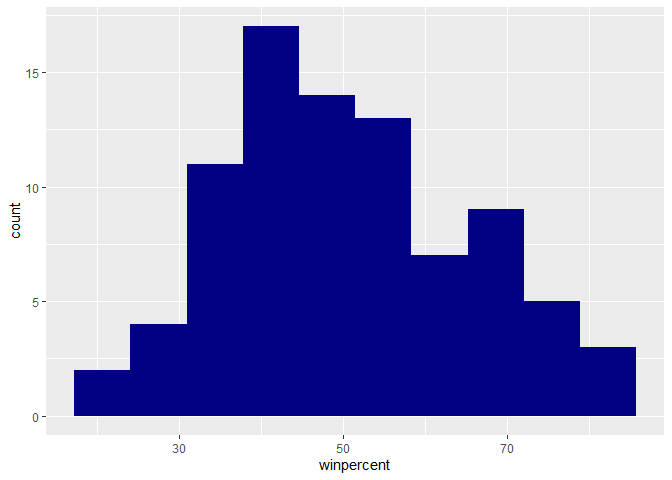
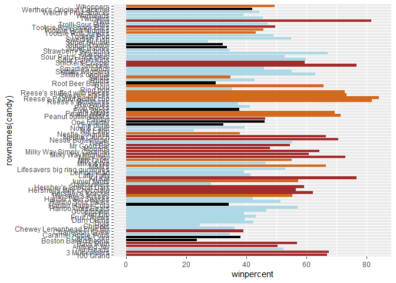
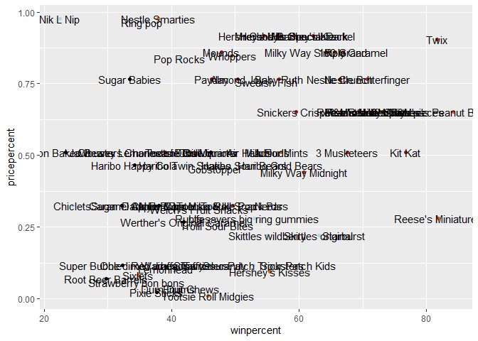
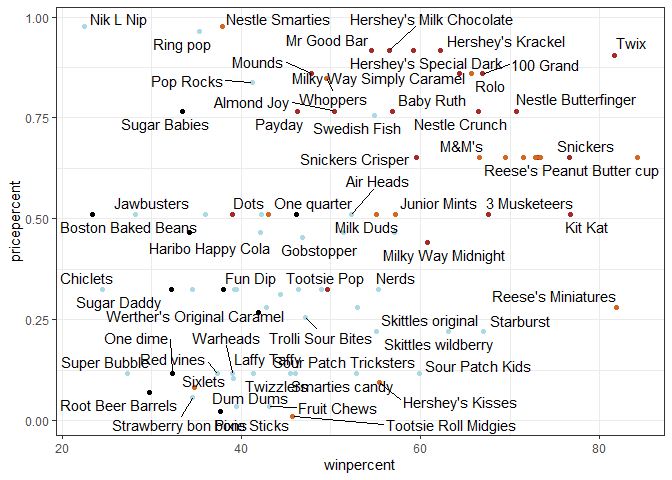
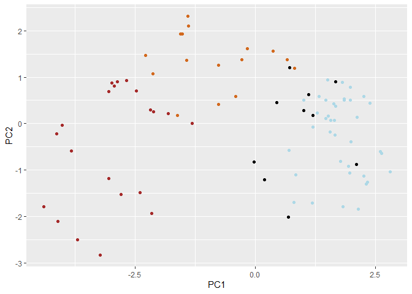
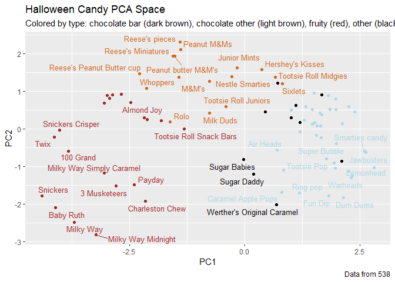
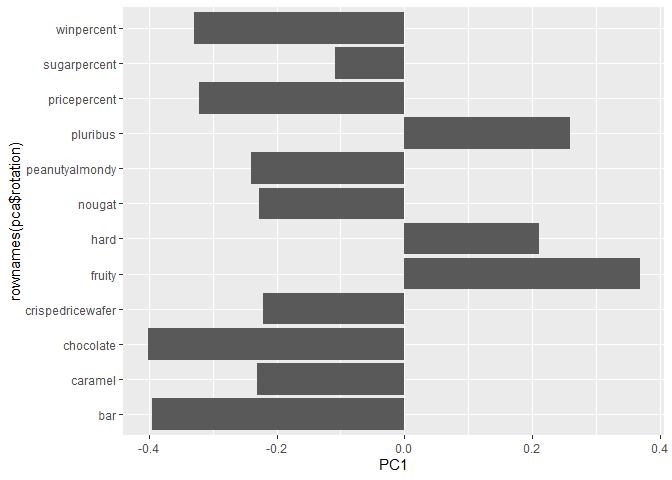

# class09
Mason Lew (PID: A17533139)

- [Taking a look at price percent](#taking-a-look-at-price-percent)
- [5. Exploring the correlation
  structure](#5-exploring-the-correlation-structure)

Today we will examine data from 538 on common halloween candy. In
particular we will use ggplot,

``` r
url <- "https://raw.githubusercontent.com/fivethirtyeight/data/master/candy-power-ranking/candy-data.csv"

candy <- read.csv(url, row.names = 1)

head(candy)
```

                 chocolate fruity caramel peanutyalmondy nougat crispedricewafer
    100 Grand            1      0       1              0      0                1
    3 Musketeers         1      0       0              0      1                0
    One dime             0      0       0              0      0                0
    One quarter          0      0       0              0      0                0
    Air Heads            0      1       0              0      0                0
    Almond Joy           1      0       0              1      0                0
                 hard bar pluribus sugarpercent pricepercent winpercent
    100 Grand       0   1        0        0.732        0.860   66.97173
    3 Musketeers    0   1        0        0.604        0.511   67.60294
    One dime        0   0        0        0.011        0.116   32.26109
    One quarter     0   0        0        0.011        0.511   46.11650
    Air Heads       0   0        0        0.906        0.511   52.34146
    Almond Joy      0   1        0        0.465        0.767   50.34755

> Q1. How many different candy types are in this dataset?

``` r
ncol(candy)
```

    [1] 12

> Q2. How many fruity candy types are in the dataset?

``` r
sum(candy$fruity)
```

    [1] 38

> How many chocolate candies are there

``` r
sum(candy$chocolate)
```

    [1] 37

> Q3. What is your favorite candy in the dataset and what is it’s
> winpercent value?

``` r
candy["M&M's", "winpercent"]
```

    [1] 66.57458

``` r
candy["M&M's",]$winpercent
```

    [1] 66.57458

> Q4. What is the winpercent value for “Kit Kat”?

``` r
candy["Kit Kat",]$winpercent
```

    [1] 76.7686

> Q5. What is the winpercent value for “Tootsie Roll Snack Bars”?

``` r
candy["Tootsie Roll Snack Bars",]$winpercent
```

    [1] 49.6535

``` r
library("skimr")
skim(candy)
```

|                                                  |       |
|:-------------------------------------------------|:------|
| Name                                             | candy |
| Number of rows                                   | 85    |
| Number of columns                                | 12    |
| \_\_\_\_\_\_\_\_\_\_\_\_\_\_\_\_\_\_\_\_\_\_\_   |       |
| Column type frequency:                           |       |
| numeric                                          | 12    |
| \_\_\_\_\_\_\_\_\_\_\_\_\_\_\_\_\_\_\_\_\_\_\_\_ |       |
| Group variables                                  | None  |

Data summary

**Variable type: numeric**

| skim_variable | n_missing | complete_rate | mean | sd | p0 | p25 | p50 | p75 | p100 | hist |
|:---|---:|---:|---:|---:|---:|---:|---:|---:|---:|:---|
| chocolate | 0 | 1 | 0.44 | 0.50 | 0.00 | 0.00 | 0.00 | 1.00 | 1.00 | ▇▁▁▁▆ |
| fruity | 0 | 1 | 0.45 | 0.50 | 0.00 | 0.00 | 0.00 | 1.00 | 1.00 | ▇▁▁▁▆ |
| caramel | 0 | 1 | 0.16 | 0.37 | 0.00 | 0.00 | 0.00 | 0.00 | 1.00 | ▇▁▁▁▂ |
| peanutyalmondy | 0 | 1 | 0.16 | 0.37 | 0.00 | 0.00 | 0.00 | 0.00 | 1.00 | ▇▁▁▁▂ |
| nougat | 0 | 1 | 0.08 | 0.28 | 0.00 | 0.00 | 0.00 | 0.00 | 1.00 | ▇▁▁▁▁ |
| crispedricewafer | 0 | 1 | 0.08 | 0.28 | 0.00 | 0.00 | 0.00 | 0.00 | 1.00 | ▇▁▁▁▁ |
| hard | 0 | 1 | 0.18 | 0.38 | 0.00 | 0.00 | 0.00 | 0.00 | 1.00 | ▇▁▁▁▂ |
| bar | 0 | 1 | 0.25 | 0.43 | 0.00 | 0.00 | 0.00 | 0.00 | 1.00 | ▇▁▁▁▂ |
| pluribus | 0 | 1 | 0.52 | 0.50 | 0.00 | 0.00 | 1.00 | 1.00 | 1.00 | ▇▁▁▁▇ |
| sugarpercent | 0 | 1 | 0.48 | 0.28 | 0.01 | 0.22 | 0.47 | 0.73 | 0.99 | ▇▇▇▇▆ |
| pricepercent | 0 | 1 | 0.47 | 0.29 | 0.01 | 0.26 | 0.47 | 0.65 | 0.98 | ▇▇▇▇▆ |
| winpercent | 0 | 1 | 50.32 | 14.71 | 22.45 | 39.14 | 47.83 | 59.86 | 84.18 | ▃▇▆▅▂ |

> Q6. Is there any variable/column that looks to be on a different scale
> to the majority of the other columns in the dataset?

**N.B.** The `winpercent` variable is on a different scale (about a 100x
magnitude/ 1-100% versus 0-1). We will most likely need to scale the
data if we plan to do PCA.

> Q7. What do you think a zero and one represent for the
> candy\$chocolate column?

the 0s are not chocolate while the 1s are chocolate

> Q8. Plot a histogram of winpercent values

``` r
library(ggplot2)

ggplot(candy) + 
  aes(winpercent) +
  geom_histogram(bins = 10, fill = "navy")
```



> Q9. Is the distribution of winpercent values symmetrical?

No

> Q10. Is the center of the distribution above or below 50%?

``` r
summary(candy$winpercent)
```

       Min. 1st Qu.  Median    Mean 3rd Qu.    Max. 
      22.45   39.14   47.83   50.32   59.86   84.18 

mean is above 50 but median is below 50 at 47.38. The center of the
distribution is more so the median so, no the center is not above 50.

> Q11. On average is chocolate candy higher or lower ranked than fruit
> candy?

-step one: find all “chocolate” candy -step two: find their “winpercent”
values -step three: summarize these values -step four: find all “fruit”
candy -step five: find their “winpercent” values -step six: summarize
these values -step seven: compare summarized points

1.  Find all chocolate candy

``` r
choc.inds <- candy$chocolate == 1
```

2.  Find their “winpercent” values

``` r
choc.win <- candy[choc.inds,]$winpercent
```

3.  Summarize these values

``` r
choc.mean <- mean(choc.win)
choc.median <- median(choc.win)

choc.mean
```

    [1] 60.92153

``` r
choc.median
```

    [1] 60.8007

4.  Find all fruit candy

``` r
fruit.inds <- candy$fruity == 1
```

5.  Find their “winpercent”

``` r
fruit.win <- candy[fruit.inds,]$winpercent
```

6.  Summarize these values

``` r
fruit.mean <- mean(fruit.win)
fruit.median <- median(fruit.win)

fruit.mean
```

    [1] 44.11974

``` r
fruit.median
```

    [1] 42.96903

7.  Compare

``` r
choc.mean
```

    [1] 60.92153

``` r
fruit.mean
```

    [1] 44.11974

``` r
choc.median
```

    [1] 60.8007

``` r
fruit.median
```

    [1] 42.96903

On average, across both mean and median, Chocolate had a higher
`winpercent`

> Q12. Is this difference statistically significant?

``` r
t.test(choc.win, fruit.win)
```


        Welch Two Sample t-test

    data:  choc.win and fruit.win
    t = 6.2582, df = 68.882, p-value = 2.871e-08
    alternative hypothesis: true difference in means is not equal to 0
    95 percent confidence interval:
     11.44563 22.15795
    sample estimates:
    mean of x mean of y 
     60.92153  44.11974 

Yes! The difference is statistically significant based on a ttest at 95%
confidence resulting in a p-value \<.05.

> Q13. What are the five least liked candy types in this set?

``` r
#not that useful - it just sorts values
sort(candy$winpercent)
```

     [1] 22.44534 23.41782 24.52499 27.30386 28.12744 29.70369 32.23100 32.26109
     [9] 33.43755 34.15896 34.51768 34.57899 34.72200 35.29076 36.01763 37.34852
    [17] 37.72234 37.88719 38.01096 38.97504 39.01190 39.14106 39.18550 39.44680
    [25] 39.46056 41.26551 41.38956 41.90431 42.17877 42.27208 42.84914 43.06890
    [33] 43.08892 44.37552 45.46628 45.73675 45.99583 46.11650 46.29660 46.41172
    [41] 46.78335 47.17323 47.82975 48.98265 49.52411 49.65350 50.34755 51.41243
    [49] 52.34146 52.82595 52.91139 54.52645 54.86111 55.06407 55.10370 55.35405
    [57] 55.37545 56.49050 56.91455 57.11974 57.21925 59.23612 59.52925 59.86400
    [65] 60.80070 62.28448 63.08514 64.35334 65.71629 66.47068 66.57458 66.97173
    [73] 67.03763 67.60294 69.48379 70.73564 71.46505 72.88790 73.09956 73.43499
    [81] 76.67378 76.76860 81.64291 81.86626 84.18029

``` r
x <- c(10, 1, 100)
order(x)
```

    [1] 2 1 3

``` r
x [order(x)]
```

    [1]   1  10 100

The `order()` function tells us how to arrange the elements of the input
to make them sorted - i.e. how to order them

We can determine the order of winpercent to make them sorted and use
that order to arrange the whole data set

``` r
ord.inds <- order(candy$winpercent)
head(candy[ord.inds,])
```

                       chocolate fruity caramel peanutyalmondy nougat
    Nik L Nip                  0      1       0              0      0
    Boston Baked Beans         0      0       0              1      0
    Chiclets                   0      1       0              0      0
    Super Bubble               0      1       0              0      0
    Jawbusters                 0      1       0              0      0
    Root Beer Barrels          0      0       0              0      0
                       crispedricewafer hard bar pluribus sugarpercent pricepercent
    Nik L Nip                         0    0   0        1        0.197        0.976
    Boston Baked Beans                0    0   0        1        0.313        0.511
    Chiclets                          0    0   0        1        0.046        0.325
    Super Bubble                      0    0   0        0        0.162        0.116
    Jawbusters                        0    1   0        1        0.093        0.511
    Root Beer Barrels                 0    1   0        1        0.732        0.069
                       winpercent
    Nik L Nip            22.44534
    Boston Baked Beans   23.41782
    Chiclets             24.52499
    Super Bubble         27.30386
    Jawbusters           28.12744
    Root Beer Barrels    29.70369

> Q14. What are the top 5 all time favorite candy types out of this set?

``` r
ord.inds <- order(candy$winpercent)
tail(candy[ord.inds,])
```

                              chocolate fruity caramel peanutyalmondy nougat
    Reese's pieces                    1      0       0              1      0
    Snickers                          1      0       1              1      1
    Kit Kat                           1      0       0              0      0
    Twix                              1      0       1              0      0
    Reese's Miniatures                1      0       0              1      0
    Reese's Peanut Butter cup         1      0       0              1      0
                              crispedricewafer hard bar pluribus sugarpercent
    Reese's pieces                           0    0   0        1        0.406
    Snickers                                 0    0   1        0        0.546
    Kit Kat                                  1    0   1        0        0.313
    Twix                                     1    0   1        0        0.546
    Reese's Miniatures                       0    0   0        0        0.034
    Reese's Peanut Butter cup                0    0   0        0        0.720
                              pricepercent winpercent
    Reese's pieces                   0.651   73.43499
    Snickers                         0.651   76.67378
    Kit Kat                          0.511   76.76860
    Twix                             0.906   81.64291
    Reese's Miniatures               0.279   81.86626
    Reese's Peanut Butter cup        0.651   84.18029

``` r
ord.inds.d <- order(candy$winpercent, decreasing = TRUE)
head(candy[ord.inds.d,])
```

                              chocolate fruity caramel peanutyalmondy nougat
    Reese's Peanut Butter cup         1      0       0              1      0
    Reese's Miniatures                1      0       0              1      0
    Twix                              1      0       1              0      0
    Kit Kat                           1      0       0              0      0
    Snickers                          1      0       1              1      1
    Reese's pieces                    1      0       0              1      0
                              crispedricewafer hard bar pluribus sugarpercent
    Reese's Peanut Butter cup                0    0   0        0        0.720
    Reese's Miniatures                       0    0   0        0        0.034
    Twix                                     1    0   1        0        0.546
    Kit Kat                                  1    0   1        0        0.313
    Snickers                                 0    0   1        0        0.546
    Reese's pieces                           0    0   0        1        0.406
                              pricepercent winpercent
    Reese's Peanut Butter cup        0.651   84.18029
    Reese's Miniatures               0.279   81.86626
    Twix                             0.906   81.64291
    Kit Kat                          0.511   76.76860
    Snickers                         0.651   76.67378
    Reese's pieces                   0.651   73.43499

> Q15. Make a first barplot of candy ranking based on winpercent values.

``` r
ggplot(candy) +
  aes(winpercent, rownames(candy)) +
  geom_col()
```


> Q16. This is quite ugly, use the reorder() function to get the bars
> sorted by winpercent?

``` r
ggplot(candy) +
  aes(winpercent, reorder(rownames(candy), winpercent)) +
  geom_col()
```


We need to make our own separate color vector where we can spell out
exactly what candy is colored a particular color

``` r
mycols <- rep("black", nrow(candy))
mycols[candy$chocolate == 1] <- "chocolate"
mycols[candy$bar == 1] <- "brown"
mycols[candy$fruity == 1] <- "lightblue"
```

``` r
ggplot(candy) +
  aes(winpercent, rownames(candy)) +
  geom_col(fill = mycols)
```



> Q17. What is the worst ranked chocolate candy?

Hershey’s Milk Chocolate

> Q18. What is the best ranked fruity candy?

Airheads

## Taking a look at price percent

Make a plot of winpercent (x-axis) vs pricepercent (y-axis)

``` r
ggplot(candy) +
  aes(winpercent, pricepercent, label = rownames(candy)) +
  geom_point(col = mycols) +
  geom_text()
```



to avoid over plotting of text we can use the `repel` package.

``` r
library(ggrepel)

ggplot(candy) +
  aes(winpercent, pricepercent, label = rownames(candy)) +
  geom_point(col = mycols) +
  geom_text_repel(max.overlaps = 12) +
  theme_bw()
```

    Warning: ggrepel: 20 unlabeled data points (too many overlaps). Consider
    increasing max.overlaps



> Q19. Which candy type is the highest ranked in terms of winpercent for
> the least money - i.e. offers the most bang for your buck?

Reese’s Miniatures

> Q20. What are the top 5 most expensive candy types in the dataset and
> of these which is the least popular?

``` r
ord <- order(candy$pricepercent, decreasing = TRUE)
head( candy[ord,c(11,12)], n=5 )
```

                             pricepercent winpercent
    Nik L Nip                       0.976   22.44534
    Nestle Smarties                 0.976   37.88719
    Ring pop                        0.965   35.29076
    Hershey's Krackel               0.918   62.28448
    Hershey's Milk Chocolate        0.918   56.49050

The least popular of the top 5 most expensive candies is Nik L Nip

> Q21. Make a barplot again with geom_col() this time using pricepercent
> and then improve this step by step, first ordering the x-axis by value
> and finally making a so called “dot chat” or “lollipop” chart by
> swapping geom_col() for geom_point() + geom_segment().

``` r
ggplot(candy) +
  aes(pricepercent, reorder(rownames(candy), pricepercent)) +
  geom_segment(aes(yend = reorder(rownames(candy), pricepercent), 
                   xend = 0), col="gray40") +
    geom_point()
```


## 5. Exploring the correlation structure

Now that we have explored the dataset a little, we will see how the
variables interact with one another.

First we will use correlation and view the results with the **corrplot**
package to plot a correlation matrix

``` r
cij <- cor(candy)
```

``` r
library (corrplot)
```

    corrplot 0.95 loaded

``` r
corrplot(cij)
```


> Q22. Examining this plot what two variables are anti-correlated
> (i.e. have minus values)?

fruit and chocolate are anti-correlated (but any red values)

> Q23. Similarly, what two variables are most positively correlated?

variables are correlated with themselves. The variables that are
positively correlated would be chocolate and winpercent and chocolate
with pricepercent (anything in blue)

\##PCA

Let’s applyy PCA using `prcomp`

``` r
pca <- prcomp(candy, scale = TRUE)
```

``` r
summary(pca)
```

    Importance of components:
                              PC1    PC2    PC3     PC4    PC5     PC6     PC7
    Standard deviation     2.0788 1.1378 1.1092 1.07533 0.9518 0.81923 0.81530
    Proportion of Variance 0.3601 0.1079 0.1025 0.09636 0.0755 0.05593 0.05539
    Cumulative Proportion  0.3601 0.4680 0.5705 0.66688 0.7424 0.79830 0.85369
                               PC8     PC9    PC10    PC11    PC12
    Standard deviation     0.74530 0.67824 0.62349 0.43974 0.39760
    Proportion of Variance 0.04629 0.03833 0.03239 0.01611 0.01317
    Cumulative Proportion  0.89998 0.93832 0.97071 0.98683 1.00000

``` r
attributes(pca)
```

    $names
    [1] "sdev"     "rotation" "center"   "scale"    "x"       

    $class
    [1] "prcomp"

Let’s plot our main results as our PCA “score plot”

``` r
p <- ggplot(pca$x) +
  aes(PC1, PC2, label = rownames(pca$x)) +
  geom_point(col=mycols) 
p
```



``` r
library(ggrepel)

p + geom_text_repel(size=3.3, col=mycols, max.overlaps = 7)  + 
  theme(legend.position = "none") +
  labs(title="Halloween Candy PCA Space",
       subtitle="Colored by type: chocolate bar (dark brown), chocolate other (light brown), fruity (red), other (black)",
       caption="Data from 538")
```

    Warning: ggrepel: 43 unlabeled data points (too many overlaps). Consider
    increasing max.overlaps



Finally lets look at how the original variables contribute to the PCs,
Start with PC 1

``` r
ggplot(pca$rotation) + 
  aes(PC1, rownames(pca$rotation)) +
  geom_col()
```



> Q24. What original variables are picked up strongly by PC1 in the
> positive direction? Do these make sense to you?

Fruity, hard, and pluribus. Yes, this makes sense to me as these match
the results of the correlation plot from earlier.
