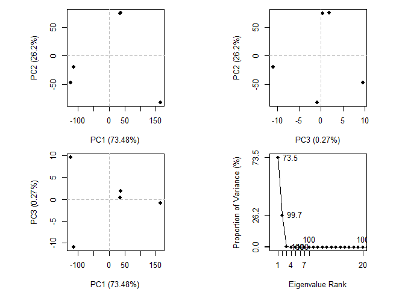
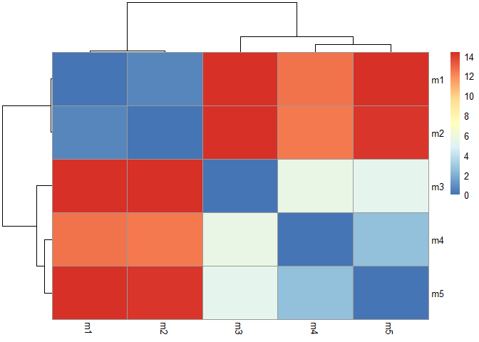
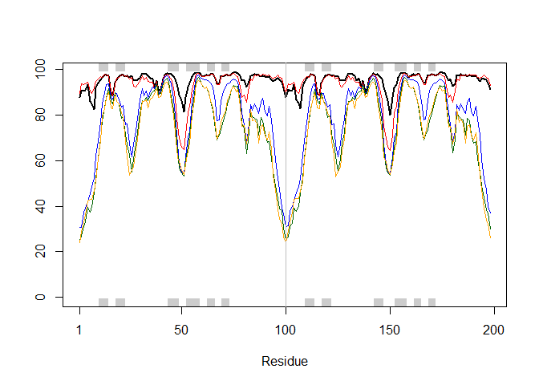
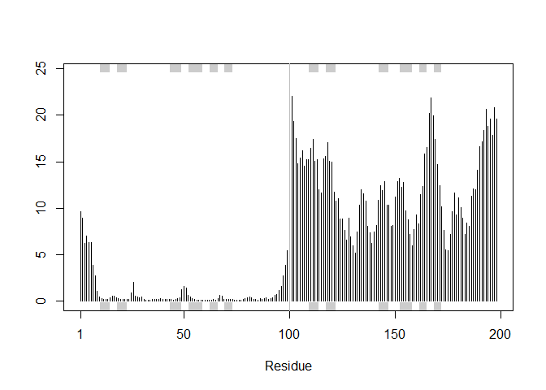

# 11: Structural Bioinformatics (pt2. Focus on new AlphaFold2)
Mason Lew (PID: A17533139)
2025-03-17

Here we are going to analyze our AlphaFold structure prediction models.
The input directory/folder comes from the ColabFold server:

``` r
#Change this for your results dir name
results_dir <- "hivpr_dimer_23119/"
```

``` r
#File names for all PDB models
pdb_files <- list.files(path = "/Users/Mason/Desktop/BIMM143/Class11/hivpr_dimer_23119",
                        pattern = ".pdb",
                        full.names = TRUE)

#printing PDB file names
basename(pdb_files)
```

    [1] "hivpr_dimer_23119_unrelaxed_rank_001_alphafold2_multimer_v3_model_1_seed_000.pdb"
    [2] "hivpr_dimer_23119_unrelaxed_rank_002_alphafold2_multimer_v3_model_5_seed_000.pdb"
    [3] "hivpr_dimer_23119_unrelaxed_rank_003_alphafold2_multimer_v3_model_4_seed_000.pdb"
    [4] "hivpr_dimer_23119_unrelaxed_rank_004_alphafold2_multimer_v3_model_2_seed_000.pdb"
    [5] "hivpr_dimer_23119_unrelaxed_rank_005_alphafold2_multimer_v3_model_3_seed_000.pdb"

I will now be using BIO3D for further analysis

``` r
library(bio3d)
```

Align and superpose

``` r
pdbs <- pdbaln(pdb_files, fit = TRUE, exefile = "msa")
```

    Reading PDB files:
    /Users/Mason/Desktop/BIMM143/Class11/hivpr_dimer_23119/hivpr_dimer_23119_unrelaxed_rank_001_alphafold2_multimer_v3_model_1_seed_000.pdb
    /Users/Mason/Desktop/BIMM143/Class11/hivpr_dimer_23119/hivpr_dimer_23119_unrelaxed_rank_002_alphafold2_multimer_v3_model_5_seed_000.pdb
    /Users/Mason/Desktop/BIMM143/Class11/hivpr_dimer_23119/hivpr_dimer_23119_unrelaxed_rank_003_alphafold2_multimer_v3_model_4_seed_000.pdb
    /Users/Mason/Desktop/BIMM143/Class11/hivpr_dimer_23119/hivpr_dimer_23119_unrelaxed_rank_004_alphafold2_multimer_v3_model_2_seed_000.pdb
    /Users/Mason/Desktop/BIMM143/Class11/hivpr_dimer_23119/hivpr_dimer_23119_unrelaxed_rank_005_alphafold2_multimer_v3_model_3_seed_000.pdb
    .....

    Extracting sequences

    pdb/seq: 1   name: /Users/Mason/Desktop/BIMM143/Class11/hivpr_dimer_23119/hivpr_dimer_23119_unrelaxed_rank_001_alphafold2_multimer_v3_model_1_seed_000.pdb 
    pdb/seq: 2   name: /Users/Mason/Desktop/BIMM143/Class11/hivpr_dimer_23119/hivpr_dimer_23119_unrelaxed_rank_002_alphafold2_multimer_v3_model_5_seed_000.pdb 
    pdb/seq: 3   name: /Users/Mason/Desktop/BIMM143/Class11/hivpr_dimer_23119/hivpr_dimer_23119_unrelaxed_rank_003_alphafold2_multimer_v3_model_4_seed_000.pdb 
    pdb/seq: 4   name: /Users/Mason/Desktop/BIMM143/Class11/hivpr_dimer_23119/hivpr_dimer_23119_unrelaxed_rank_004_alphafold2_multimer_v3_model_2_seed_000.pdb 
    pdb/seq: 5   name: /Users/Mason/Desktop/BIMM143/Class11/hivpr_dimer_23119/hivpr_dimer_23119_unrelaxed_rank_005_alphafold2_multimer_v3_model_3_seed_000.pdb 

``` r
pdbs
```

                                   1        .         .         .         .         50 
    [Truncated_Name:1]hivpr_dime   PQITLWQRPLVTIKIGGQLKEALLDTGADDTVLEEMSLPGRWKPKMIGGI
    [Truncated_Name:2]hivpr_dime   PQITLWQRPLVTIKIGGQLKEALLDTGADDTVLEEMSLPGRWKPKMIGGI
    [Truncated_Name:3]hivpr_dime   PQITLWQRPLVTIKIGGQLKEALLDTGADDTVLEEMSLPGRWKPKMIGGI
    [Truncated_Name:4]hivpr_dime   PQITLWQRPLVTIKIGGQLKEALLDTGADDTVLEEMSLPGRWKPKMIGGI
    [Truncated_Name:5]hivpr_dime   PQITLWQRPLVTIKIGGQLKEALLDTGADDTVLEEMSLPGRWKPKMIGGI
                                   ************************************************** 
                                   1        .         .         .         .         50 

                                  51        .         .         .         .         100 
    [Truncated_Name:1]hivpr_dime   GGFIKVRQYDQILIEICGHKAIGTVLVGPTPVNIIGRNLLTQIGCTLNFP
    [Truncated_Name:2]hivpr_dime   GGFIKVRQYDQILIEICGHKAIGTVLVGPTPVNIIGRNLLTQIGCTLNFP
    [Truncated_Name:3]hivpr_dime   GGFIKVRQYDQILIEICGHKAIGTVLVGPTPVNIIGRNLLTQIGCTLNFP
    [Truncated_Name:4]hivpr_dime   GGFIKVRQYDQILIEICGHKAIGTVLVGPTPVNIIGRNLLTQIGCTLNFP
    [Truncated_Name:5]hivpr_dime   GGFIKVRQYDQILIEICGHKAIGTVLVGPTPVNIIGRNLLTQIGCTLNFP
                                   ************************************************** 
                                  51        .         .         .         .         100 

                                 101        .         .         .         .         150 
    [Truncated_Name:1]hivpr_dime   QITLWQRPLVTIKIGGQLKEALLDTGADDTVLEEMSLPGRWKPKMIGGIG
    [Truncated_Name:2]hivpr_dime   QITLWQRPLVTIKIGGQLKEALLDTGADDTVLEEMSLPGRWKPKMIGGIG
    [Truncated_Name:3]hivpr_dime   QITLWQRPLVTIKIGGQLKEALLDTGADDTVLEEMSLPGRWKPKMIGGIG
    [Truncated_Name:4]hivpr_dime   QITLWQRPLVTIKIGGQLKEALLDTGADDTVLEEMSLPGRWKPKMIGGIG
    [Truncated_Name:5]hivpr_dime   QITLWQRPLVTIKIGGQLKEALLDTGADDTVLEEMSLPGRWKPKMIGGIG
                                   ************************************************** 
                                 101        .         .         .         .         150 

                                 151        .         .         .         .       198 
    [Truncated_Name:1]hivpr_dime   GFIKVRQYDQILIEICGHKAIGTVLVGPTPVNIIGRNLLTQIGCTLNF
    [Truncated_Name:2]hivpr_dime   GFIKVRQYDQILIEICGHKAIGTVLVGPTPVNIIGRNLLTQIGCTLNF
    [Truncated_Name:3]hivpr_dime   GFIKVRQYDQILIEICGHKAIGTVLVGPTPVNIIGRNLLTQIGCTLNF
    [Truncated_Name:4]hivpr_dime   GFIKVRQYDQILIEICGHKAIGTVLVGPTPVNIIGRNLLTQIGCTLNF
    [Truncated_Name:5]hivpr_dime   GFIKVRQYDQILIEICGHKAIGTVLVGPTPVNIIGRNLLTQIGCTLNF
                                   ************************************************ 
                                 151        .         .         .         .       198 

    Call:
      pdbaln(files = pdb_files, fit = TRUE, exefile = "msa")

    Class:
      pdbs, fasta

    Alignment dimensions:
      5 sequence rows; 198 position columns (198 non-gap, 0 gap) 

    + attr: xyz, resno, b, chain, id, ali, resid, sse, call

``` r
pc <- pca(pdbs)
plot(pc)
```



\##RMSD Analysis

RMSD is a common measure of structural distance

``` r
rd <- rmsd(pdbs, fit=T)
```

    Warning in rmsd(pdbs, fit = T): No indices provided, using the 198 non NA positions

``` r
rd
```

                                                                                 hivpr_dimer_23119_unrelaxed_rank_001_alphafold2_multimer_v3_model_1_seed_000
    hivpr_dimer_23119_unrelaxed_rank_001_alphafold2_multimer_v3_model_1_seed_000                                                                        0.000
    hivpr_dimer_23119_unrelaxed_rank_002_alphafold2_multimer_v3_model_5_seed_000                                                                        0.602
    hivpr_dimer_23119_unrelaxed_rank_003_alphafold2_multimer_v3_model_4_seed_000                                                                       14.376
    hivpr_dimer_23119_unrelaxed_rank_004_alphafold2_multimer_v3_model_2_seed_000                                                                       12.629
    hivpr_dimer_23119_unrelaxed_rank_005_alphafold2_multimer_v3_model_3_seed_000                                                                       14.342
                                                                                 hivpr_dimer_23119_unrelaxed_rank_002_alphafold2_multimer_v3_model_5_seed_000
    hivpr_dimer_23119_unrelaxed_rank_001_alphafold2_multimer_v3_model_1_seed_000                                                                        0.602
    hivpr_dimer_23119_unrelaxed_rank_002_alphafold2_multimer_v3_model_5_seed_000                                                                        0.000
    hivpr_dimer_23119_unrelaxed_rank_003_alphafold2_multimer_v3_model_4_seed_000                                                                       14.372
    hivpr_dimer_23119_unrelaxed_rank_004_alphafold2_multimer_v3_model_2_seed_000                                                                       12.497
    hivpr_dimer_23119_unrelaxed_rank_005_alphafold2_multimer_v3_model_3_seed_000                                                                       14.219
                                                                                 hivpr_dimer_23119_unrelaxed_rank_003_alphafold2_multimer_v3_model_4_seed_000
    hivpr_dimer_23119_unrelaxed_rank_001_alphafold2_multimer_v3_model_1_seed_000                                                                       14.376
    hivpr_dimer_23119_unrelaxed_rank_002_alphafold2_multimer_v3_model_5_seed_000                                                                       14.372
    hivpr_dimer_23119_unrelaxed_rank_003_alphafold2_multimer_v3_model_4_seed_000                                                                        0.000
    hivpr_dimer_23119_unrelaxed_rank_004_alphafold2_multimer_v3_model_2_seed_000                                                                        5.507
    hivpr_dimer_23119_unrelaxed_rank_005_alphafold2_multimer_v3_model_3_seed_000                                                                        5.292
                                                                                 hivpr_dimer_23119_unrelaxed_rank_004_alphafold2_multimer_v3_model_2_seed_000
    hivpr_dimer_23119_unrelaxed_rank_001_alphafold2_multimer_v3_model_1_seed_000                                                                       12.629
    hivpr_dimer_23119_unrelaxed_rank_002_alphafold2_multimer_v3_model_5_seed_000                                                                       12.497
    hivpr_dimer_23119_unrelaxed_rank_003_alphafold2_multimer_v3_model_4_seed_000                                                                        5.507
    hivpr_dimer_23119_unrelaxed_rank_004_alphafold2_multimer_v3_model_2_seed_000                                                                        0.000
    hivpr_dimer_23119_unrelaxed_rank_005_alphafold2_multimer_v3_model_3_seed_000                                                                        2.549
                                                                                 hivpr_dimer_23119_unrelaxed_rank_005_alphafold2_multimer_v3_model_3_seed_000
    hivpr_dimer_23119_unrelaxed_rank_001_alphafold2_multimer_v3_model_1_seed_000                                                                       14.342
    hivpr_dimer_23119_unrelaxed_rank_002_alphafold2_multimer_v3_model_5_seed_000                                                                       14.219
    hivpr_dimer_23119_unrelaxed_rank_003_alphafold2_multimer_v3_model_4_seed_000                                                                        5.292
    hivpr_dimer_23119_unrelaxed_rank_004_alphafold2_multimer_v3_model_2_seed_000                                                                        2.549
    hivpr_dimer_23119_unrelaxed_rank_005_alphafold2_multimer_v3_model_3_seed_000                                                                        0.000

``` r
range(rd)
```

    [1]  0.000 14.376

``` r
library(pheatmap)

colnames(rd) <- paste0("m", 1:5)
rownames(rd) <- paste0("m", 1:5)
pheatmap(rd)
```



Mol\* superposed dimers structure:


``` r
# Read a reference PDB structure
pdb <- read.pdb("1hsg")
```

      Note: Accessing on-line PDB file

``` r
plotb3(pdbs$b[1,], typ="l", lwd=2, sse=pdb)
points(pdbs$b[2,], typ="l", col="red")
points(pdbs$b[3,], typ="l", col="blue")
points(pdbs$b[4,], typ="l", col="darkgreen")
points(pdbs$b[5,], typ="l", col="orange")
abline(v=100, col="gray")
```



``` r
core <- core.find(pdbs)
```

     core size 197 of 198  vol = 4916.702 
     core size 196 of 198  vol = 4311.481 
     core size 195 of 198  vol = 4101.445 
     core size 194 of 198  vol = 3907.124 
     core size 193 of 198  vol = 3711.925 
     core size 192 of 198  vol = 3546.511 
     core size 191 of 198  vol = 3440.437 
     core size 190 of 198  vol = 3317.571 
     core size 189 of 198  vol = 3220.079 
     core size 188 of 198  vol = 3142.057 
     core size 187 of 198  vol = 3066.79 
     core size 186 of 198  vol = 3015.892 
     core size 185 of 198  vol = 2959.969 
     core size 184 of 198  vol = 2913.74 
     core size 183 of 198  vol = 2880.923 
     core size 182 of 198  vol = 2848.081 
     core size 181 of 198  vol = 2857.001 
     core size 180 of 198  vol = 2871.24 
     core size 179 of 198  vol = 2905.696 
     core size 178 of 198  vol = 2953.776 
     core size 177 of 198  vol = 3020.847 
     core size 176 of 198  vol = 3087.22 
     core size 175 of 198  vol = 3109.99 
     core size 174 of 198  vol = 3129.601 
     core size 173 of 198  vol = 3135.085 
     core size 172 of 198  vol = 3092.283 
     core size 171 of 198  vol = 3036.012 
     core size 170 of 198  vol = 2947.995 
     core size 169 of 198  vol = 2886.897 
     core size 168 of 198  vol = 2829.355 
     core size 167 of 198  vol = 2746.377 
     core size 166 of 198  vol = 2671.189 
     core size 165 of 198  vol = 2600.848 
     core size 164 of 198  vol = 2534.651 
     core size 163 of 198  vol = 2464.3 
     core size 162 of 198  vol = 2390.171 
     core size 161 of 198  vol = 2322.47 
     core size 160 of 198  vol = 2236.698 
     core size 159 of 198  vol = 2160.475 
     core size 158 of 198  vol = 2077.281 
     core size 157 of 198  vol = 2003.596 
     core size 156 of 198  vol = 1939.94 
     core size 155 of 198  vol = 1859.188 
     core size 154 of 198  vol = 1781.083 
     core size 153 of 198  vol = 1699.1 
     core size 152 of 198  vol = 1622.558 
     core size 151 of 198  vol = 1546.319 
     core size 150 of 198  vol = 1473.01 
     core size 149 of 198  vol = 1414.087 
     core size 148 of 198  vol = 1352.547 
     core size 147 of 198  vol = 1295.278 
     core size 146 of 198  vol = 1246.999 
     core size 145 of 198  vol = 1203.962 
     core size 144 of 198  vol = 1163.009 
     core size 143 of 198  vol = 1110.955 
     core size 142 of 198  vol = 1064.672 
     core size 141 of 198  vol = 1028.458 
     core size 140 of 198  vol = 986.121 
     core size 139 of 198  vol = 944.003 
     core size 138 of 198  vol = 895.914 
     core size 137 of 198  vol = 853.508 
     core size 136 of 198  vol = 827.977 
     core size 135 of 198  vol = 796.874 
     core size 134 of 198  vol = 772.763 
     core size 133 of 198  vol = 743.108 
     core size 132 of 198  vol = 707.65 
     core size 131 of 198  vol = 669.172 
     core size 130 of 198  vol = 634.655 
     core size 129 of 198  vol = 594.035 
     core size 128 of 198  vol = 559.154 
     core size 127 of 198  vol = 525.971 
     core size 126 of 198  vol = 493.19 
     core size 125 of 198  vol = 466.473 
     core size 124 of 198  vol = 438.433 
     core size 123 of 198  vol = 410.725 
     core size 122 of 198  vol = 401.38 
     core size 121 of 198  vol = 391.76 
     core size 120 of 198  vol = 362.084 
     core size 119 of 198  vol = 338.183 
     core size 118 of 198  vol = 312.338 
     core size 117 of 198  vol = 282.176 
     core size 116 of 198  vol = 262.215 
     core size 115 of 198  vol = 241.577 
     core size 114 of 198  vol = 225.151 
     core size 113 of 198  vol = 204.137 
     core size 112 of 198  vol = 185.038 
     core size 111 of 198  vol = 162.728 
     core size 110 of 198  vol = 146.181 
     core size 109 of 198  vol = 133.352 
     core size 108 of 198  vol = 123.207 
     core size 107 of 198  vol = 109.228 
     core size 106 of 198  vol = 98.824 
     core size 105 of 198  vol = 89.735 
     core size 104 of 198  vol = 81.206 
     core size 103 of 198  vol = 74.188 
     core size 102 of 198  vol = 67.042 
     core size 101 of 198  vol = 62.043 
     core size 100 of 198  vol = 58.432 
     core size 99 of 198  vol = 55.149 
     core size 98 of 198  vol = 51.114 
     core size 97 of 198  vol = 45.798 
     core size 96 of 198  vol = 41.161 
     core size 95 of 198  vol = 35.619 
     core size 94 of 198  vol = 29.784 
     core size 93 of 198  vol = 23.233 
     core size 92 of 198  vol = 16.669 
     core size 91 of 198  vol = 9.459 
     core size 90 of 198  vol = 4.595 
     core size 89 of 198  vol = 3.161 
     core size 88 of 198  vol = 2.678 
     core size 87 of 198  vol = 2.293 
     core size 86 of 198  vol = 1.935 
     core size 85 of 198  vol = 1.619 
     core size 84 of 198  vol = 1.367 
     core size 83 of 198  vol = 1.09 
     core size 82 of 198  vol = 0.906 
     core size 81 of 198  vol = 0.764 
     core size 80 of 198  vol = 0.649 
     core size 79 of 198  vol = 0.596 
     core size 78 of 198  vol = 0.53 
     core size 77 of 198  vol = 0.486 
     FINISHED: Min vol ( 0.5 ) reached

``` r
core.inds <- print(core, vol=0.51)
```

    # 78 positions (cumulative volume <= 0.51 Angstrom^3) 
      start end length
    1    10  25     16
    2    28  48     21
    3    53  93     41

``` r
xyz <- pdbfit(pdbs, core.inds, outpath = "corefit_structures")
```

``` r
rf <- rmsf(xyz)

plotb3(rf, sse=pdb)
abline(v=100, col="gray", ylab="RMSF")
```


