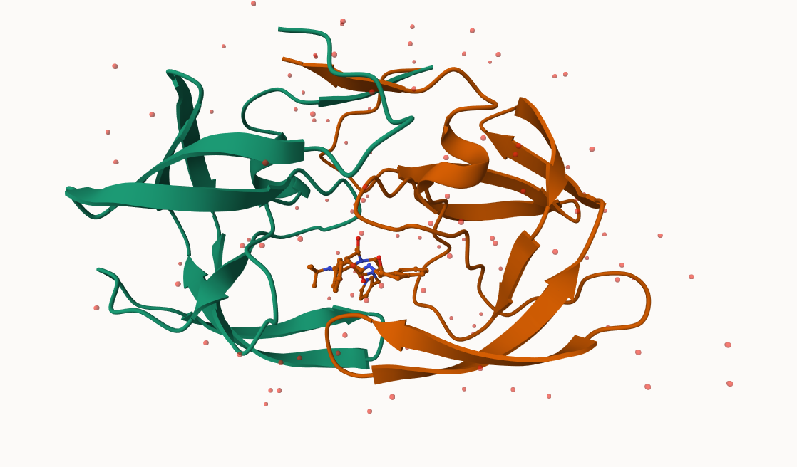

# Class 10: Structural Bioinformatics pt. 1
Mason Lew (PID: A17533139)
2025-03-17

- [1. The PDB databade](#1-the-pdb-databade)
- [2. Using Mol\*](#2-using-mol)
- [3. Introduction to Bio3D in R](#3-introduction-to-bio3d-in-r)
- [4. Prediciting function dynamics](#4-prediciting-function-dynamics)

## 1. The PDB databade

The main repository of biomolecular structure data is called the PDB
found at: https://www.rcsb.org

Let’s see what this database contains. TO do this go to PDB \> Analyze
\> PDB statistics \> By Experimental Method and Molecular Type

> Q1: What percentage of structures in the PDB are solved by X-Ray and
> Electron Microscopy.

``` r
pdbstats <- read.csv("Data Export Summary.csv")
pdbstats
```

               Molecular.Type   X.ray     EM    NMR Multiple.methods Neutron Other
    1          Protein (only) 169,563 16,774 12,578              208      81    32
    2 Protein/Oligosaccharide   9,939  2,839     34                8       2     0
    3              Protein/NA   8,801  5,062    286                7       0     0
    4     Nucleic acid (only)   2,890    151  1,521               14       3     1
    5                   Other     170     10     33                0       0     0
    6  Oligosaccharide (only)      11      0      6                1       0     4
        Total
    1 199,236
    2  12,822
    3  14,156
    4   4,580
    5     213
    6      22

``` r
pdbstats$X.ray
```

    [1] "169,563" "9,939"   "8,801"   "2,890"   "170"     "11"     

The “,” in these numbers is causing them to be read as character rather
than numeric.

I can fix this by replacing “,” fo rnothing “” wiht the `sub()` funciton

``` r
x <- pdbstats$X.ray
sum(as.numeric(sub(",", "", x)))
```

    [1] 191374

Or I can use the **readr** package and the `read_csv()` function.

``` r
library(readr)

pdbstats <- read_csv("Data Export Summary.csv")
```

    Rows: 6 Columns: 8
    ── Column specification ────────────────────────────────────────────────────────
    Delimiter: ","
    chr (1): Molecular Type
    dbl (3): Multiple methods, Neutron, Other
    num (4): X-ray, EM, NMR, Total

    ℹ Use `spec()` to retrieve the full column specification for this data.
    ℹ Specify the column types or set `show_col_types = FALSE` to quiet this message.

``` r
pdbstats
```

    # A tibble: 6 × 8
      `Molecular Type`   `X-ray`    EM   NMR `Multiple methods` Neutron Other  Total
      <chr>                <dbl> <dbl> <dbl>              <dbl>   <dbl> <dbl>  <dbl>
    1 Protein (only)      169563 16774 12578                208      81    32 199236
    2 Protein/Oligosacc…    9939  2839    34                  8       2     0  12822
    3 Protein/NA            8801  5062   286                  7       0     0  14156
    4 Nucleic acid (onl…    2890   151  1521                 14       3     1   4580
    5 Other                  170    10    33                  0       0     0    213
    6 Oligosaccharide (…      11     0     6                  1       0     4     22

I want to clean the column names so they are all lower case and don’t
have spaces in them

``` r
colnames(pdbstats)
```

    [1] "Molecular Type"   "X-ray"            "EM"               "NMR"             
    [5] "Multiple methods" "Neutron"          "Other"            "Total"           

``` r
library(janitor)
```


    Attaching package: 'janitor'

    The following objects are masked from 'package:stats':

        chisq.test, fisher.test

``` r
df <- clean_names(pdbstats)
df
```

    # A tibble: 6 × 8
      molecular_type         x_ray    em   nmr multiple_methods neutron other  total
      <chr>                  <dbl> <dbl> <dbl>            <dbl>   <dbl> <dbl>  <dbl>
    1 Protein (only)        169563 16774 12578              208      81    32 199236
    2 Protein/Oligosacchar…   9939  2839    34                8       2     0  12822
    3 Protein/NA              8801  5062   286                7       0     0  14156
    4 Nucleic acid (only)     2890   151  1521               14       3     1   4580
    5 Other                    170    10    33                0       0     0    213
    6 Oligosaccharide (onl…     11     0     6                1       0     4     22

Total number of X-ray structures

``` r
xray <- sum(df$x_ray)
xray
```

    [1] 191374

Total number of structures

``` r
total <- sum(df$total)
total
```

    [1] 231029

Percentage of structures covered by x-ray

``` r
xray/total * 100
```

    [1] 82.83549

Total number of EM

``` r
em <- sum(df$em)
em
```

    [1] 24836

Percent of data covered by em

``` r
em/total * 100
```

    [1] 10.75017

> Q2: What proportion of structures in the PDB are protein?

Total number of proteins

``` r
protein <- sum(df[1,8], df[2,8], df[3,8])
protein
```

    [1] 226214

Percent of structures that are proteins

``` r
protein/total * 100
```

    [1] 97.91585

> Q3: Type HIV in the PDB website search box on the home page and
> determine how many HIV-1 protease structures are in the current PDB?

231,029

## 2. Using Mol\*

The main Mol\* homepage at: https://molstar.org/viewer/ We can input our
own PDB files or just give it a PDB database accession code (4 letter
PDB code)



> Q4: Water molecules normally have 3 atoms. Why do we see just one atom
> per water molecule in this structure?

Simplified view


> Q5: There is a critical “conserved” water molecule in the binding
> site. Can you identify this water molecule? What residue number does
> this water molecule have


Above Depicts HOH 308

> Q6: Generate and save a figure clearly showing the two distinct chains
> of HIV-protease along with the ligand. You might also consider showing
> the catalytic residues ASP 25 in each chain and the critical water (we
> recommend “Ball & Stick” for these side-chains). Add this figure to
> your Quarto document.

> Discussion Topic: Can you think of a way in which indinavir, or even
> larger ligands and substrates, could enter the binding site?


## 3. Introduction to Bio3D in R

We can use the **bio3d** package for structural bioinformatics to read
PDB data into R

``` r
library(bio3d)

pdb <- read.pdb("1hsg")
```

      Note: Accessing on-line PDB file

``` r
pdb
```


     Call:  read.pdb(file = "1hsg")

       Total Models#: 1
         Total Atoms#: 1686,  XYZs#: 5058  Chains#: 2  (values: A B)

         Protein Atoms#: 1514  (residues/Calpha atoms#: 198)
         Nucleic acid Atoms#: 0  (residues/phosphate atoms#: 0)

         Non-protein/nucleic Atoms#: 172  (residues: 128)
         Non-protein/nucleic resid values: [ HOH (127), MK1 (1) ]

       Protein sequence:
          PQITLWQRPLVTIKIGGQLKEALLDTGADDTVLEEMSLPGRWKPKMIGGIGGFIKVRQYD
          QILIEICGHKAIGTVLVGPTPVNIIGRNLLTQIGCTLNFPQITLWQRPLVTIKIGGQLKE
          ALLDTGADDTVLEEMSLPGRWKPKMIGGIGGFIKVRQYDQILIEICGHKAIGTVLVGPTP
          VNIIGRNLLTQIGCTLNF

    + attr: atom, xyz, seqres, helix, sheet,
            calpha, remark, call

> Q7: How many amino acid residues are there in this pdb object?

``` r
length(pdbseq(pdb))
```

    [1] 198

> Q8: Name one of the two non-protein residues?

Mk1

> Q9: How many protein chains are in this structure?

2 chains A and B

Looking at the `pdb` object in more detail

``` r
attributes(pdb)
```

    $names
    [1] "atom"   "xyz"    "seqres" "helix"  "sheet"  "calpha" "remark" "call"  

    $class
    [1] "pdb" "sse"

``` r
head(pdb$atom)
```

      type eleno elety  alt resid chain resno insert      x      y     z o     b
    1 ATOM     1     N <NA>   PRO     A     1   <NA> 29.361 39.686 5.862 1 38.10
    2 ATOM     2    CA <NA>   PRO     A     1   <NA> 30.307 38.663 5.319 1 40.62
    3 ATOM     3     C <NA>   PRO     A     1   <NA> 29.760 38.071 4.022 1 42.64
    4 ATOM     4     O <NA>   PRO     A     1   <NA> 28.600 38.302 3.676 1 43.40
    5 ATOM     5    CB <NA>   PRO     A     1   <NA> 30.508 37.541 6.342 1 37.87
    6 ATOM     6    CG <NA>   PRO     A     1   <NA> 29.296 37.591 7.162 1 38.40
      segid elesy charge
    1  <NA>     N   <NA>
    2  <NA>     C   <NA>
    3  <NA>     C   <NA>
    4  <NA>     O   <NA>
    5  <NA>     C   <NA>
    6  <NA>     C   <NA>

Let’s try a new function not yet in the bio3d package. It requires the
**r3dmol** package that we need to install with
`install.packages("r3dmol")` + `install.packages("shiny")`

``` r
source("https://tinyurl.com/viewpdb")
#view.pdb(pdb, backgroundColor = "lightblue")
```

## 4. Prediciting function dynamics

We can use the `nma()` function in bio3d to predict the large-scale
functional motions of biomolecules.

``` r
adk <- read.pdb("6s36")
```

      Note: Accessing on-line PDB file
       PDB has ALT records, taking A only, rm.alt=TRUE

``` r
adk
```


     Call:  read.pdb(file = "6s36")

       Total Models#: 1
         Total Atoms#: 1898,  XYZs#: 5694  Chains#: 1  (values: A)

         Protein Atoms#: 1654  (residues/Calpha atoms#: 214)
         Nucleic acid Atoms#: 0  (residues/phosphate atoms#: 0)

         Non-protein/nucleic Atoms#: 244  (residues: 244)
         Non-protein/nucleic resid values: [ CL (3), HOH (238), MG (2), NA (1) ]

       Protein sequence:
          MRIILLGAPGAGKGTQAQFIMEKYGIPQISTGDMLRAAVKSGSELGKQAKDIMDAGKLVT
          DELVIALVKERIAQEDCRNGFLLDGFPRTIPQADAMKEAGINVDYVLEFDVPDELIVDKI
          VGRRVHAPSGRVYHVKFNPPKVEGKDDVTGEELTTRKDDQEETVRKRLVEYHQMTAPLIG
          YYSKEAEAGNTKYAKVDGTKPVAEVRADLEKILG

    + attr: atom, xyz, seqres, helix, sheet,
            calpha, remark, call

``` r
m <- nma(adk)
```

     Building Hessian...        Done in 0.09 seconds.
     Diagonalizing Hessian...   Done in 0.7 seconds.

``` r
plot(m)
```


Write out a trajectory of the predicted molecular motion:

``` r
mktrj(m, file="adk_m7.pdb")
```
