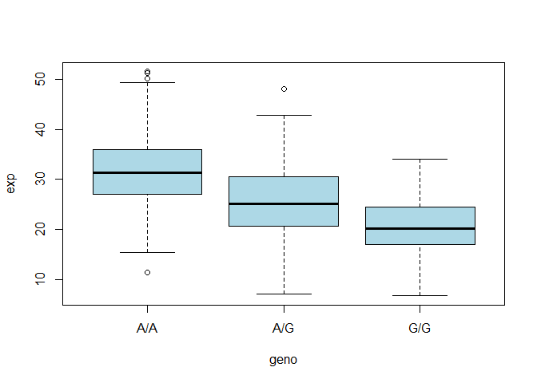

# class12_hw
Mason Lew (PID: A17533139)
2025-03-17

> Q13: Read this file into R and determine the sample size for each
> genotype and their corresponding median expression levels for each of
> these genotypes. Hint: The read.table(), summary() and boxplot()
> functions will likely be useful here. There is an example R script
> online to be used ONLY if you are struggling in vein. Note that you
> can find the medium value from saving the output of the boxplot()
> function to an R object and examining this object. There is also the
> medium() and summary() function that you can use to check your
> understanding.

Read data:

``` r
url <- "https://bioboot.github.io/bimm143_W25/class-material/rs8067378_ENSG00000172057.6.txt"

data <- read.table(url)
head(data)
```

       sample geno      exp
    1 HG00367  A/G 28.96038
    2 NA20768  A/G 20.24449
    3 HG00361  A/A 31.32628
    4 HG00135  A/A 34.11169
    5 NA18870  G/G 18.25141
    6 NA11993  A/A 32.89721

``` r
summary(data)
```

        sample              geno                exp        
     Length:462         Length:462         Min.   : 6.675  
     Class :character   Class :character   1st Qu.:20.004  
     Mode  :character   Mode  :character   Median :25.116  
                                           Mean   :25.640  
                                           3rd Qu.:30.779  
                                           Max.   :51.518  

Now I will check how many of each genotype are present within the data
set:

``` r
sum (data$geno == "G/G")
```

    [1] 121

``` r
sum (data$geno == "A/G")
```

    [1] 233

``` r
sum (data$geno == "A/A")
```

    [1] 108

``` r
sum (data$geno == "G/A")
```

    [1] 0

Checking for median expression levels:

``` r
GG <- data$geno == "G/G"

median(data[GG, 3])
```

    [1] 20.07363

``` r
AG <- data$geno == "A/G"

median(data[AG, 3])
```

    [1] 25.06486

``` r
AA <- data$geno == "A/A"

median(data[AA, 3])
```

    [1] 31.24847

In summary: - G/G: 121 samples present, 20.0763 median expression
levels - A/G: 233 samples present, 25.06486 median expression levels -
A/A: 108 samples present, 31.24847 median epxression levels

> Q14: Generate a boxplot with a box per genotype, what could you infer
> from the relative expression value between A/A and G/G displayed in
> this plot? Does the SNP effect the expression of ORMDL3?

``` r
boxplot(exp ~ geno, data, col = 'light blue')
```



The expression of a G allele seems to decrease the expression values.
Comparing the A/A to G/G, the G/G samples has a much lower levels of
expressions indicating that the SNP DOES affect epxression levels.
